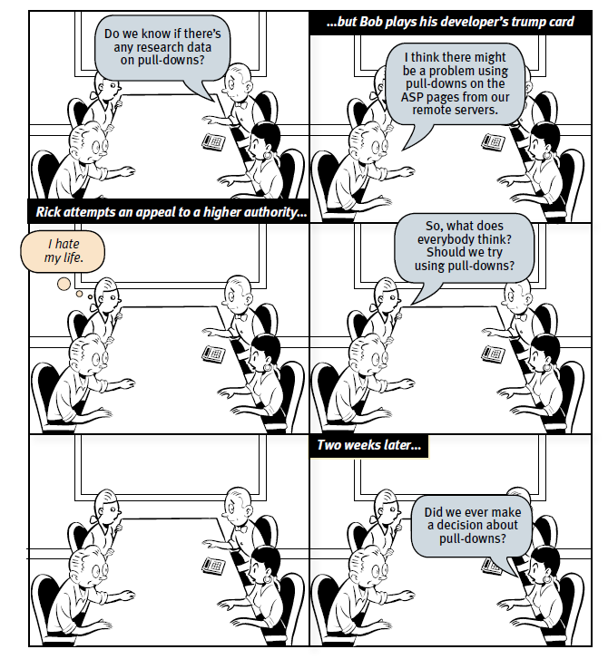

# Aula 2: Histórico e Processo

## Um Pouco de História

Um bom lugar para começar nossa história é em Julho de 1945, quando Vannevar Bush escreveu um artigo para o Atlantic Monthly, mais tarde reimpresso na revista Life, chamado "Como Nós Podemos Pensar". Hoje, a tecnologia tem sobretudo aumentado as habilidades físicas das pessoas; Bush delineou uma visão para tecnologias da informação que aumentou as habilidades intelectuais das pessoas. O objetivo deste artigo, escrito no final da Segunda Guerra Mundial, era perguntar "O que cientistas financiados pelo governo podem fazer para criar um mundo melhor em tempo de paz?" e sua visão era fortemente antropocentrica. Bush escreveu sobre uma futura mesa interativa; ele chamou o sistema de "Memex".

A ideia é que todas as informações do mundo estariam disponíveis na área de trabalho dos trabalhadores do conhecimento. A chave para a ideia do Memex era interfaces eficazes para o armazenamento e a recuperação de informação. Lembre-se, estamos em 1945, portanto, ainda não existem os práticos computadores digitais —os primeiros computadores digitais, do tamanho de uma sala, estavam sendo construídos —e a ideia era usar microfichas - filme de alta densidade - para armazenar tudo! Ainda mais impressionante, a visão de Bush para o Memex inventou o hipertexto.

Ele teve essa ideia de que as pessoas poderiam criar trilhas através deste estoque de informações, salvá-las para usar mais tarde, e compartilhá-las com outros. Mas você nem sempre está na sua mesa, certo? Você quer que a tecnologia venha com você. E os trabalhadores do conhecimento precisam produzir conteúdo, bem como consumi-lo. E o mundo não é só textual, mas também visual. Então, Bush imaginou que, no futuro, você usaria uma câmera bem no centro de sua cabeça, como um terceiro olho, e a usaria para capturar as coisas. E ele elaborou um projeto que tornou isso tão fácil quanto possível para tirar fotos. Assim, não teria nenhum discador ou configuração para lidar. Assim como a mesa Memex, os detalhes ocorreram de forma diferente; mas a visão central ficou intacta. Hoje, por exemplo, há mais de um bilhão de telefones com câmera que as pessoas carregam com elas. Os computadores digitais programáveis que logo vieram, como o ENIACS lá, foram uma enorme previsão tecnológica.

Mas, como já discutimos, a interface de usuário deixou muito a desejar. A ideia de fornecer uma interface mais eficaz aos computadores tem uma longa e lendária história, começando com a invenção do primeiro compilador, por Grace Hopper, no início da década de 1950 O que é inspirador para mim é que ela conceituou como ferramentas aprimoradas poderiam fornecer acesso à computação a um público muito mais amplo. Nos anos seguintes, bons ambientes de programação para o desktop e Web permitiram que legiões de desenvolvedores criassem o conteúdo que ajudou a colocar um PC em cada mesa.

É um longo caminho desde o trabalho visionário de Grace Hopper no compilador até a interface gráfica do usuário. As sementes da manipulação direta foram lançadas no Lincoln Labs da MIT por Ivan Sutherland. A principal inovação da interface gráfica é que a entrada do usuário é realizada diretamente sobre a saída do sistema.  Essa diretriz de entrada-saída faz a interface ser muito mais intuitiva e fácil de entender.
No caso de Bloco de Notas de Sutherland, a entrada era uma caneta de luz e a saída era um osciloscópio. 

Em 1945, Doug Engelbart foi um técnico de radar da Marinha. Engelbart passou seus anos monótonos nas Filipinas. Na biblioteca, ele encontrou um exemplar da revista Life; Ele copiou o artigo de Bush da Atlantic Monthly. Como John Markov escreve, a ideia de um dispositivo que poderia estender o poder da mente humana deixou Engelbart boquiaberto. Ele teve uma visão. Levou um longo tempo, mas finalmente ele recebeu algum financiamento e começou a trabalhar.

E o que Doug Engelbart trouxe, ele mostrou ao mundo em sua famosa demonstração em 1968. 

"O programa de pesquisa que eu vou descrever para vocês é rapidamente caracterizável , dizendo: se, em seu escritório, você, como um trabalhador intelectual, foi equipado com um monitor de computador, acompanhado por um computador que ficava ligado para você o dia inteiro, e era infinitamente sensível às reações que você tem, quanto valor que você extrairá disso? E em um instante você olhará a tela e ela está funcionando. E a maneira como o cursor move em conjunto com os movimentos do mouse."

O mouse de Engelbart funcionava com duas rodas ortogonais.Cada um era um potenciômetro, um resistor variável, assim como aparelhos de som geralmente têm em um botão de volume. Então você consegue girar em torno de 300º. O seu parâmetro utilizável fornecia cerca de 5 polegadas de movimento em cada direção.

Após a demonstração de 1968, Doug pega a estrada. Ele viaja pelo país com um projetor 16 milímetros da Bell & Howell. Ivan Sutherland tinha se juntado recentemente ao corpo docente da Universidade de Utah. Doug veio em visita e apresentou a demo, e na platéia estava o aluno de doutorado de Ivan, Alan Kay.
Alan vinha sonhando com um computador pessoal. Ele vê o vídeo de Engelbart e seus olhos se arregalaram - eles tinham o mesmo sonho. Após o seu pós-doutoramento, Alan mudou-se para o Laboratório de AI da Stanford, onde o grupo de John McCarthy tinha um sistema de compartilhamento dos primeiros tempos, talvez o lugar no mundo onde cada pessoa tinha seu próprio terminal.De lá, ele vai para a Xerox PARC, onde dá vida à sua visão de um Dynabook.

Acima está uma foto do protótipo que Alan fez no início dos anos 1970. Este não é um computador funcional; ele é feito de papelão; é um protótipo desenhado para comunicar uma visão. Com esta visão em mãos, Alan Kay e seus colegas da Xerox PARC começaram a construir a fundação da primeira real interface gráfica do usuário . Eles levaram uma década para conseguir juntar tudo, para deixá-lo pronto para entrega. 

Xerox lançou o sistema de computação STAR em 1981. O STAR possuía um display de bitmap, uma interface gráfica baseada em janelas, ícones, pastas, mouses, rede ethernet, servidores de arquivos, servidores de impressão e e-mail. Usando a tecla MOVE, você pode organizar sua área de trabalho da maneira que você gostar. Fazer uma cópia de um desses documentos em branco é como transformar uma folha de ofício em um bloco de papel.

A capacidade dos usuários de produzirem seus próprios formulários é um exemplo da usabilidade incorporada ao sistema. A tela se aproxima bastante da aparência de uma página impressa. O STAR foi lançado quase quatro décadas após a visão de Vannevar Bush, três décadas depois do compilador de Grace Hopper, duas décadas depois do primeiro sistema de Doug Engelbart funcionar, e uma década depois de Alan Kay começar a trabalhar na construção deste computador, inspirado nas ideias do Dynabook.

Depois disso, vem Steve Jobs com o Macintosh, talvez roubando (ou pegando emprestado) algumas dessas coisas da XEROX, e então Bill Gates com o Windows, e, décadas depois, Jobs nos traz o iPhone.

## Processo de Design

Times de desenvolvimento de software podem não ser muito bons em relação a decisões de usabilidade. Do livro Don’t Make me Think:

Esse é um tipo de debate que muito se assemelha com discussões políticas ou religiosas. Pessoas expressam opiniões pessoais fortes sobre coisas que não podem ser demonstradas, tentando, supostamente, concordar na melhor forma de fazer algo. Mas os pontos de vista raramente mudam. Além de desperdiçar tempo, essas discussões criam tensões desnecessárias entre membros da equipe, atrasando decisões críticas.

Não é produtivo questionar se “a maioria das pessoas gostam de menus pull-down?” A pergunta certa a fazer é “este menu pull-down, com estes itens e este texto, neste contexto, nesta tela, cria um boa experiência para a maioria das pessoas que vão usar esta tela?” E só tem um jeito de responder esse tipo de pergunta: criando alternativas e testando. Por isso acaba sendo produtivo pensar em um processo de design, com ideias, protótipos, análise e testes de usabilidade. Mesmo que não existam designers na equipe, ou que a princípio “não se previu tempo para isso”, é importante seguir um processo mínimo de design de interação.

Os objetivos do processo de design podem ser listados desta forma, variando em ordem de importância:

* identificar as necessidades dos usuários ou verificar o entendimento dos designers sobre estas necessidades, garantido que foram bem entendidas as solicitações;

* identificar problemas de interação ou de interface;

* investigar como uma interface compromete a forma em que os usuários trabalham;

* comparar alternativas de projeto de interface;

* alcançar objetivos quantificáveis em métricas de usabilidade; e

* verificar conformidade com um padrão ou conjunto de heurísticas.

### Atividades

Trata-se de atividades um pouco genéricas, que podem também ser encontradas em outras áreas de design. Podemos pensar nessas atividades como apenas um modelo, não necessariamente de forma prescritiva para a prática de design de interação.

1. Identificar necessidades e estabelecer requisitos: Para projetar algo que realmente dê suporte as atividades das pessoas, devemos conhecer quem são nossos usuarios-alvo e que tipo de suporle urn produto interativo poderia oferecer de maneira útil. Essas necessidades constituem as bnscs dos requisitos do produto e sustentam o design e  o desenvolvimento subsequentes. Essa atividade é fundamental para uma abordagem centrada no usuário.

2. Desenvolver designs alternativos que preencham os requisitos: sugerir ideias que atendam aos requisitos, eis a atividade central. Primeiro, design conceitual, descrevendo o que o produto deveria fazer, como se comportar e com o que parecer. Depois, design físico, considerando detalhes como cores, sons e imagens, design de menu e design de ícones. As alternativas são consideradas em cada ponto.

3. Construir versões interativas de designs, para serem comunicados e analisados: Melhor maneira de avaliar os designs, interagir com eles, mesmo que não seja em software. Por exemplo, protótipos de papel, simulando a interação com o produto.

4. Avaliar o que está sendo construído durante o processo: processo de determinar a usabilidade e aceitabilidade do produto ou design. Medida por vários critérios, como número de erros que usuários cometem, etc. Exige alto grau de participação do usuário, aumentando as chances de se entregar um produto aceitável.  

### Modelo de Ciclo de Vida

Capta um conjunto de atividades e a maneira como elas se relacionam. Para projetos que envolvam poucos e experientes desenvolvedores, um processo simples seria provavelmente o mais adequado. No entanto, para sistemas maiores que envolvem dezenas de centenas de desenvolvedores com centenas de milhares de usuários, um simples processo não é suficiente para proporcionar a estrutura e a disciplina de gerência necessárias para realizar a engenharia de um produlo usável. É necessário entao algo que promova mais formalidade e disciplina. 

A maioria dos projelos inicia com a identificação de necessidades e requisitos. O projeto pode ter surgido por conta de alguma avaliação feita, mas o início do cicio de vida do produto novo (ou modificado) se dá nesse ponto. A partir de tal atividade, alguns designs alternativos são gerados numa tentativa de irem ao encontro de necessidades e requisitos identificados. Então, as versões interativas dos designs são desenvolvidas e avaliadas. Com base no feedback das avaliações, há a possibilidade de a equipe precisar retomar e identificar necessidades ou refinar os requisitos, ou então passar diretamente para o redesign. Há também a possibilidade de mais de uma alternativa de design seguir esse ciclo iterativo em paralelo com outros, ou de apenas uma alternativa por vez ser considerada. Está implícito, nesse ciclo, que o produto final irá emergir da evolução de uma ideia inicial bruta até o seu produto acabado. A maneira como essa evolução ocorre exatamente pode variar de projeto para projeto. O único fator que limita o número de vezes desse ciclo são os recursos disponíveis; no entanto, seja qual for o número de vezes, o desenvolvimento termina com uma atividade de avaliação que assegura que o produto final respeita os critérios de usabilidade prescritos.

### Um Exemplo de Processo de Design: Design Thinking

A noção de design como uma “forma de pensar” tem sua origem traçada a partir de 1969, nas ciências, no livro The Science of the Artificial, de Herbert A. Simon e mais especificamente na Engenharia, a partir de 1973, com Experiences in Visual Thinking, de Robert McKim. Rolf Faste, professor de Stanford, definiu e popularizou o conceito de design thinking como uma forma de ação criativa. 
Foi adaptada à Administração por David M. Kelley, fundador da IDEO, empresa de consultoria de design de produtos dos EUA, que apesar de não ter inventado o termo, foi um dos primeiros formadores de opinião sobre o tema. Atualmente, existe um grande interesse em design thinking e design cognitivo, tanto no mundo acadêmico como no mundo dos negócios, com uma demanda crescente por palestras e simpósios sobre o tema. 

Design Thinking é uma metodologia de desenvolvimento de produtos e serviços focados nas necessidades, desejos e limitações dos usuários. Nesse sentido é uma forma de pensar baseada ou focada em soluções, com um objetivo inicial, em vez de começar com um determinado problema. Então, concentrando no presente e no futuro, os parâmetros do problema e suas soluções são exploradas simultaneamente. O que o diferencia do método científico é que este se inicia definindo todos os parâmetros do problema em questão para a definição de um objetivo. 

O processo se divide em quatro etapas:

Imersão: a primeira etapa sugere um mergulho em tudo o que envolve e afeta a sua empresa. Aqui, é válido realizar uma análise SWOT, que mapeia as ameças, oportunidades, fraquezas e pontos fortes do problema, tando do ponto de vista interno quanto da perspectiva externa.

Ideação: Como o nome sugere, aqui se produz ideias relevantes para realizar as melhorias necessárias. Deve-se reunir as equipes envolvidas e adotar técnicas como o brainstorming, que incentiva e valoriza o compartilhamento de muitas ideias.

Prototipação: Depois de reunir uma grande quantidade de ideias relevantes, deve-se impor um filtro sobre elas e escolher as que você (ou o grupo) considera com maiores chances de sucesso. Para reduzir o risco de falhas, é recomendado criar protótipos do que foi idealizado antes de realmente investir em sua execução. Se o assunto em questão é um serviço, você pode montar protótipos mais abstratos, como representações gráficas que simulem as ações reais.

Desenvolvimento: Depois do protótipo pronto, é a hora de testar com usuários se o produto realmente funciona ou não, e por fim, implementar o resultado final. Após testar e se atentar ao feedback para melhorar o protótipo, a mercadoria já pode ir para as lojas/implantação. 

