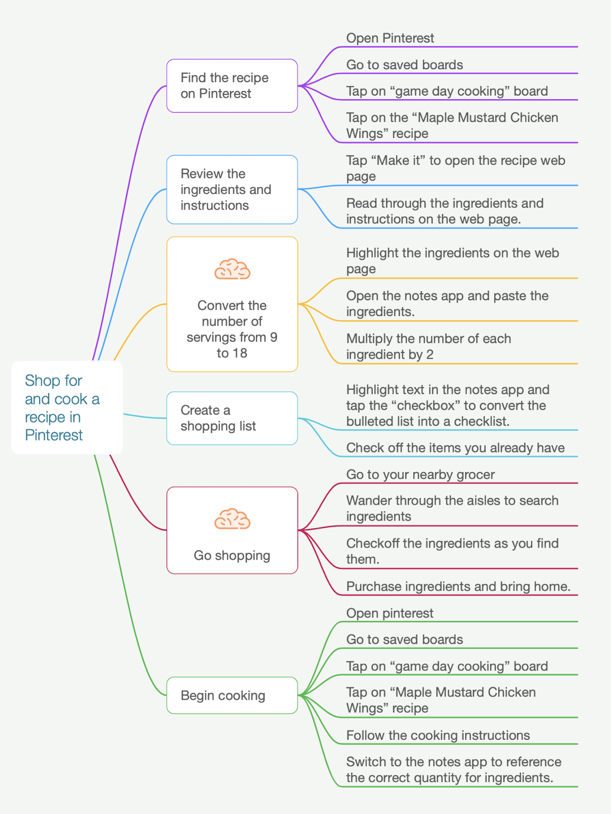

# Aula 5: Levantamento de Necessidades (Design centrado no usuário)

## Definições

Um requisito, o que é? Um tratado sobre o produto ou sistema pretendido, especificando o que é esperado dele, ou como ele irá desempenhar essa tarefa. Por exemplo, um requisito para um app de smartwatch pode ser carregar um mapa em menos de um segundo. Outro, talvez menos importante, é que o app precisa ter apelo com os adolescentes. 

A atividade de elicitação de requisitos já é velha conhecida da engenharia de software. Nela, a equipe identifica, esclarece e captura os requisitos. Não menos importante, nessa atividade são identificados os critérios pelos quais serão avaliadas as entregas posteriores. Com o tempo, evoluímos o conhecimento acerca dessa atividade; a forma como devemos desempenhá-la mudou de algo como a prescrição de uma receita no início de um projeto para uma atividade essencialmente iterativa, em ciclos de feedback cada vez mais curtos, com entregas periódicas graduais que vão auxiliando usuários e desenvolvedores a compreender o que é preciso ser feito. 

Mas, qual a diferença nessa atividade quando falamos de design UI/UX? Os métodos de coleta mudam um pouco, pois o **foco no usuário** é mais intenso. Além disso, os critérios de aceitação enfatizam usabilidade e experiência de usuário, no lugar das funcionalidades esperadas. Se estamos com foco no design centrado no usuário (UCD), a gestão desses requisitos acaba se tornando essencial para o sucesso do projeto como um todo. 

Talvez a forma mais usada de representar requisitos dentro de equipes de software é a **estória de usuário (user story - US)**. Uma US representa um pequeno pedaço de valor a ser entregue pelo sistema para o usuário; de fato, uma unidade normalmente desenvolvida dentro de um sprint. Um formato padrão para US:

*Como uma (papel), quero (comportamento) para que eu (benefício)*

Exemplos de um aplicativo de organização de viagens:

* Como um viajante, quero favoritar algumas companhias aéreas nas minhas viagens, para que eu possa coletar mais milhagem.
* Como um agente de viagem, quero visualizar com ênfase minhas taxas especiais de desconto, para que eu possa oferecer ao cliente valores competitivos.

Uma US acaba sendo uma unidade de gestão de projeto, pois inclui informações de priorização, critérios de teste e estimativa.

O estudo de Engenharia de Software define um conjunto razoável de tipos de requisitos, o que facilita sua identificação (funcionais, não-funcionais, etc.). No entanto, para o design UI/UX, vamos enfatizar apenas dois deles: requisitos de **características de usuários** e **metas de usabilidade/experiência de usuário**.

Requisitos de *Características de usuário* capturam os atributos chave do grupo de usuários alvo, tais como capacidades e aptidões, além de sua base educacional, preferências, circunstâncias pessoais, incluindo limitações físicas ou mentais. Mais ainda, usuários podem ser iniciantes, experientes, ou então casuais ou frequentes, o que afeta a forma como a interação será projetada. Por exemplo, usuários iniciantes devem preferir um direcionamento passo-a-passo; já um experiente pode preferir uma interação flexível, com maior poder de controle. A coleção de características para um usuário típico chama-se *perfil (profile) de usuário*. Qualquer sistema pode incluir vários perfis de usuário.

*Metas de usabilidade/experiência de usuário* acabam sendo o tipo de requisito mais importante para o design de UI/UX. Aqui, métricas objetivas podem ser usadas para definir critérios de aceitação para uma determinada funcionalidade (algo como o usuário deve realizar certa tarefa dentro de um limite de tempo, ou com um baixo número de cliques mínimo). No entanto, critérios qualitativos podem ser usados, mesmo que sejam mais difíceis de coletar. Imagine aí, como saber se uma forma de interação está agradando? Se está deixando as pessoas mais produtivas, ou menos frustradas?

A partir de agora, vamos discutir os *métodos* usados comumente em equipes de design para coletar esses requisitos, além dos principais *artefatos* produzidos dentro desta atividade.

## Técnicas de Coleta

De cara, em toda referência que se encontra sobre o tema, vamos achar três formas básicas de coleta de informações sobre usuários: entrevistas, observação e questionários. 

Para qualquer atividade como essas, é preciso **identificar participantes**. Os objetivos definidos para um determinado projeto devem indicar os tipos de pessoa a partir das quais coletaremos dados. Para projetos de maior alcance, provavelmente será preciso definir uma amostra representativa da população-alvo. Para entrevistas ou observações, o número de pessoas estudadas depende da possível saturação da informação (quando nada de novo aparece, a fase de entrevistas pode ser encerrada).

Qualquer relacionamento com as pessoas precisa ser profissional, a ponto de exigir algum tipo de termo de consentimento. Normalmente, são usados padrões para cada tipo de estudo. Um **formulário de consentimento informado** é feito para proteger os interesses de ambos, pesquisador e pessoa estudada.

É muito comum nesse contexto usar de **triangulação**, que se refere à investigação de um fenômeno a partir de duas ou mais perspectivas, em que dados advém de fontes diversas. Isso permite validar os resultados de alguma investigação ao apontar resultados similares a partir de perspectivas diferentes, ou até suprir limitações de um método específico. Por exemplo, questionários podem ser ótimos em relatar situações gerais a partir de números, mas a razão por que aqueles resultados acontecem só pode ser investigada através de entrevistas.

Independente do método de coleta, o registro de dados pode se dar de várias formas, para que possamos analisar e compartilhar resultados. As mais comuns? **notas escritas, fotografias, áudio ou vídeo**. Por exemplo, entrevistas podem ser gravadas como áudio para análise posterior, e fotografias do momento da entrevista podem lembrar quem pesquisa do contexto da discussão. 

A figura abaixo resume as principais técnicas usadas para a descoberta de requisitos.

**Entrevistas** podem ser estruturadas ou não, dependendo do grau de formalização de um roteiro pré-estabelecido (obrigatório para as primeiras). O mais comum é que as entrevistas sejam *semiestruturadas*, que inclui um roteiro apenas para que sejam cobertos os principais tópicos, permitindo a exploração livre dos comos e porquês de cada uma das respostas. 

Um exemplo:
> Quais sites você visita mais vezes por dia?
> - Vários, mas o principal é o hottestmusic.com
> Por quê?
> - Gosto do layout do site
> Me descreve um pouco do layout do site
> - (Silêncio, por um tempo) ... Descreve o layout...
> Algo mais que seja interessante, sobre o site?
> - Animações, ...
> Haveria mais alguma razão para você visitar esse site tantas vezes, algo ainda não mencionado?

Algumas diretrizes para preparar um roteiro de entrevista:
* Perguntas longas ou compostas podem ser confusas ou difíceis de lembrar; quebrar em questões menores.
* Entrevistados provavelmente ignoram jargões da área ou linguagem complexa.
* Questões devem ser neutras, não devem indicar uma resposta esperada ou correta.

Uma sessão de entrevista precisa combinar descontração e conforto com algum grau de formalidade. Uma boa estrutura:

1. Uma introdução da pesquisadora e a razão da pesquisa, assegurando salvaguardas éticas e pedindo autorização para gravação.
2. Um início mais informal, com perguntas menos "ameaçadoras".
3. Um seção principal, com questões do roteiro, tentando o máximo de naturalidade, para que o entrevistado sinta-se acolhido e confortável.
4. Questões mais simples para aliviar.
5. Fechamento, com agradecimento, desligando gravação e fechando cadernos de nota ou computadores.

Por sua vez, a **observação** é uma técnica potencialmente aplicada em qualquer fase do desenvolvimento de um produto ou sistema. Talvez cedo, antes de qualquer design, ou até depois de entregas, para avaliação dos protótipos. Usuários podem ser observados diretamente pela pesquisadora enquanto realizam atividades, ou indiretamente através de gravações, logs e documentos produzidos. Eles podem ser observados tanto em ambientes reais ou controlados. 

Para observação direta de ambientes de trabalho, por exemplo, podemos usar um framework para basear nosso trabalho. Esse, proposto por Robson e McCarten (2016), encoraja prestar atenção ao contexto da atividade:

* Espaço
* Atores
* Atividades
* Objetos
* Ações
* Eventos 
* Tempo
* Objetivos
* Sentimentos

Um observador pode ser totalmente passivo, uma "mosca na parede", sem interagir com o ambiente. Por outro lado, podemos ter o observador **participante**, tornando-se um membro do grupo observado. Esse último pode ser meio difícil, pois o pesquisador precisa ter as habilidades exigidas para participar de um grupo dentro de um determinado trabalho. Estudos de observação são chamados muitas vezes de **etnografia**, método originário das ciências sociais; essa nomenclatura é adequada para observações sem qualquer planejamento ou direcionamento prévio. 

Se a observação é realizada em ambientes controlados, como em um laboratório, por exemplo, usa-se muito o protocolo de *Think-aloud*. Um dos problemas da observação pura e simples é não saber o que o usuário está pensando. Em um ambiente controlado, podemos solicitar que usuários transmitam, em voz alta, aquilo que estão pensando enquanto usam uma interface.

Um método de observação citado frequentemente no design de UI/UX é a **investigação contextual (Contextual inquiry)**; um passo além da pura entrevista, ela envolve observar pessoas no seu contexto natural enquanto perguntas são feitas pelo pesquisador para completar as lacunas de informação. Nessa investigação, o pesquisador observa como participantes realizam certas tarefas enquanto os faz descrever o que estão fazendo durante a interação com o produto; ou seja, um tipo de *Think-aloud*. 

Entre os itens de informação que podem ser coletados durante esse processo:

* O que os ajuda, o que os atrapalha
* Por que eles fazem as tarefas? Como eles fazem as tarefas?  
* Com quem eles interagem? Quais são as ferramentas usadas?
* Hacks, atalhos, gambiarras?
* Aprender sobre o que as pessoas não usam, ou não fazem.

As vantagens: dados confiáveis, observação bem objetivo, conhecimento tácito, Muitos detalhes em contexto, participante é o expert, versátil e flexível, envolvimento dos interessados. Já como desvantagens: muito custoso, logística, demora para analisar e interpretar.

Na preparação: saber seus objetivos e perguntas de pesquisa, usar NDA, definir time (moderador, anotador, mídia), definir regras no campo, planejamento do dia, semana, mês, participantes ficam informados. E na condução: tentar diminui viés de observação, deixar confortável; observar e fazer perguntas, perguntar razões e procedimentos, fazer entrevista de wrap-up; cabeça aberta, tirar fotos, respeitar o espaço, e evitar fotos de crianças.

## Artefatos

Além das USs serem artefatos importantes também para o design de UI/UX, vamos discutir alguns artefatos de requisitos específicos para esta atividade: cenários e personas.

### Perfil  de Usuário e Personas

Quanto mais designers de UI/UX sabem sobre características específicas de usuários, melhor serão suas decisões de design. Alternativas de design de UI/UX podem otimizar o desempenho de alguns tipos de usuário, mas atrasar outros (lembre-se do exemplo das UIs usadas tanto por iniciantes quanto por *experts*). Outros exemplos: sites para audiências mais visuais, como fotógrafos, provavelmente terão mais sucesso se apresentar informação chave usando gráficos, em vez de texto. 

Abaixo, um *check-list* simplificado para a classificação de grupos de usuários:

* Limitações físicas ou cognitivas

* Habilidade com o computador: altamente técnico, moderado, ou nenhuma experiência.

* Nível de experiência com o sistema

* Nível de conhecimento da tarefa

* Nível de experiência com sistemas similares

* Nível educacional

* Nível de leitura e escrita

* Idioma nativo

* Tipo de uso do sistema: obrigatório, opcional

* Frequência de uso: contínuo, esporádico, uma vez apenas

* Importância da tarefa

* Nível de repetição da tarefa

* Comunicação exigida

* Tipo de treinamento necessário

* Taxa de troca de pessoas

* Categoria profissional

* Atitude em relação ao sistema: positiva, neutra, negativa

* Níveis de motivação/paciência

* Níveis de estresse durante a tarefa

* Gênero e idade

* Características físicas, como destro ou canhoto

Um artefato comumente produzido durante a definição do perfil do usuário é a **Persona**. Personas são um retrato do público-alvo que destaca dados demográficos, comportamentos, necessidades e motivações através da criação de um personagem ficcional baseado em insights extraídos de pesquisa. Personas fazem com que os designers e desenvolvedores criem empatia com os consumidores durante o processo de design. Descrevem pessoas específicas ficcionais, mas é um retrato bastante realista. 

Uma persona representa a síntese de um número de usuários reais que se envolveu na coleta de dados, e é baseada em um conjunto de perfis de usuários. Inclui descrição de seus objetivos, seu comportamento, atitudes, atividades e ambiente.

Exemplo:

### Cenários

Um cenário é uma descrição narrativa informal, mostrando atividades e tarefas humanas, num formato de *storytelling*, permitindo a exploração e discussão de contextos, necessidades e requisitos. Provavelmente não inclui descrições sobre o uso de software ou suporte tecnológico usado pra atingir objetivos. É importante aqui usar vocabulário do ambiente do usuário, para que o cenário seja compreensível para todos os envolvidos no processo. Contar estórias é uma forma natural para as pessoas explicarem o que estão fazendo, e os envolvidos facilmente se relacionam com isso.

Cenários podem ser descritos em texto e imagens. Uma forma possível é usar alguma ferramenta de *mind mapping*. Por exemplo, a figura abaixo descreve Sharon, uma pessoa que adora procurar e armazenar novas receitas no Pinterest. O objetivo deste cenário: comprar ingredientes e preparar Asas de Frango Maple Mustard, anteriormente salva no Pinterest. Este diagrama mostra uma série de tarefas e subtarefas identificadas enquanto Sharon realizava a tarefa. Duas tarefas em especial exigiram certa carga cognitiva, marcadas com um ícone de cérebro.

Por exemplo, ao analisar essas tarefas, podemos identificar passos repetitivos e desnecessários, e talvez entender como diminuir a carga cognitiva de alguns passos. Neste exemplo, apesar do Pinterest ser elogiado na hora de descobrir e salvar receitas, ele não oferecia aqui recursos específicos para auxiliar na preparação da receita, ou na compra de ingredientes. Sharon teve que saltar entre aplicativos e até fazer cálculos de cabeça pra converter os ingredientes. Além disso, quando ela começa a preparação, ela teve que repetir suas tarefas iniciais de busca da receita. 
(Este cenário real foi realizado pelos desenvolvedores do app Favoreats, que tenta resolver essas limitações para quem usa o Pinterest para culinária).

