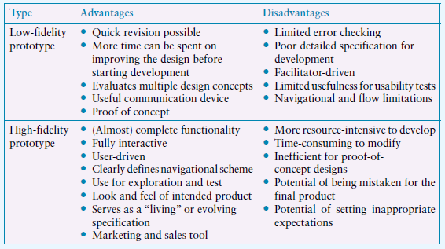

# Aula 6: Prototipação

Protótipos são poderosas ferramentas de design, que incentivam a visão e manipulação de representações da UI, úteis tanto para os **usuários entenderem o que precisam** como para os **designers saberem o que projetar**. Com os protótipos, uma equipe de design pode imaginar cenários específicos, testando-os.

Normalmente, protótipos são limitados, já que enfatizam um conjunto de características específico. Ah, também podem vir em *muitas formas*; não dá pra simplesmente dizer qual o melhor tipo de protótipo para cada ocasião. Em geral, o *custo* de criar o protótipo é que define qual tipo usar. Podemos ter protótipos em folhas de papel, ou pedaços de papelão pintados; talvez uma coleção de componentes de metal com cabos e fios à mostra; ou até uma simulação em software, interativa. 

Protótipos servem para **discutir e avaliar ideias**; são considerados, em essência, uma ferramenta de comunicação, entre designers e usuários, ou entre membros de times. A simples construção de um protótipo encoraja reflexão, sendo uma ferramenta imprescindível em qualquer processo de design. Os protótipos respondem perguntas, testam a viabilidade de certas ideias, e define se essas ideias estão em sintonia com o restante do design. 

## Protótipos de baixa fidelidade (Low-Fidelity)

Não se parece muito com um produto final. De fato, não serve para prover a funcionalidade completa. A ideia é usar materiais mais baratos, mais fáceis de manipular - papel ou papelão, por exemplo.

Esses protótipos são úteis pois tendem a ser simples, baratos e de fácil produção. O que significa que também são rapidamente modificáveis; isso é bem importante nos estágios iniciais de um projeto, já que protótipos são úteis para explorar ideias. Certamente não serão parte do produto final, por isso descartáveis.

Os mais comuns tipos de protótipo *low-fi* são os storyboards (uma representação gráfica dos cenários, que discutimos no módulo anterior) e aqueles baseados em papel/cartões.

Os protótipos baseados em papel ou cartões são bem usados para capturar e explorar elementos de uma interação, principalmente trocas entre usuário e produto. É bom porque os elementos de interação (menus, botões, etc.) propostos podem ser manipulados e movidos para simular o ação com o usuários pessoalmente, em uma experiência fim-a-fim. 

O exemplo abaixo mostra, para um aplicativo de organização de viagens de turismo, o processo que envolve requisitos de visto para um determinado país destino.  Cada cartão subentende que haverá um componente de interação que exige uma resposta do usuário ou uma saída do sistema (ou seja, o tal do diálogo). 

A primeira coluna indica uma opção inicial, e a segunda, à direita, indica como ficou depois de considerações da equipe de design e dos usuários que "testaram" a primeira proposta.  Cenários alternativos podem também ser explorados; por exemplo, cartões que envolvam mensagens de erro. 

Os cartões podem ser mostrados para usuários em potencial ou outros membros da equipe de projeto, para que seja coletado feedback. Neste exemplo, durante a discussão sobre essa primeira proposta, poderíamos chegar à conclusão que seria melhor basear a interação em um mapa mundi interativo, onde usuários indicariam seu destino e sua nacionalidade. Outra possibilidade levantada: um painel de bandeiras. Essas alternativas poderiam ser então prototipadas em um novo conjunto de cartões, coletando mais feedback. 

Um conjunto de protótipos em cartões, estabelecendo cenários de uso do software, deve então servir como base para protótipos mais detalhados, tais como rascunhos de tela. Além disso, artefatos mais formais podem ser produzidos, como é o caso do mapa de jornada de usuário (user journey map), exemplificado na figura abaixo.

## Protótipos de alta fidelidade (High-Fidelity)

Esse tipo de protótipo tem muito mais a cara de produto final, normalmente oferecendo alguma funcionalidade adicional. Por exemplo, um protótipo de um módulo de um sistema web já desenvolvido em Javascript, interativo e acessível em um endereço web válido. 

Há um espectro amplo entre baixa e alta fidelidade em protótipos. É comum que eles evoluam em vários estágios de fidelidade durante o projeto, em ciclos projetar-avaliar-reprojetar. 

Um dos potenciais problemas com protótipos de alta fidelidade é que o resultado  parece para o usuário como algo muito próximo do final, o que pode levar a uma limitação no feedback.

A figura abaixo sumariza potenciais vantagens e desvantagens dos níveis de fidelidade dos protótipos.

Um nível intermediário entre baixa e alta fidelidade é o que normalmente é chamado de **wireframe**, oferecendo, usando ferramentas de design, um rascunho geral de elementos padronizados (botões, menus e rótulos), com alguma indicação de navegação. Em muitos projetos de software, este é considerado o último estágio de prototipação. 

## Ferramentas de prototipação

Muitas ferramentas digitais são usadas na prática por equipes de design, principalmente durante a prototipação, em variados níveis de fidelidade. Muitas vezes, até protótipos de baixa fidelidade são produzidos em ferramentas interativas, para que haja uma interação mais precisa - apesar disso, muita gente prefere a interação em grupo provocada pelos protótipos baseados em papel. 

Ferramentas comerciais que dão suporte para a criação de wireframes ou mock-ups são muitas. Apenas algumas:
*  Sketch (https://www.sketch.com/)
* Figma (https://www.figma.com/)
* Adobe XD (https://www.adobe.com/products/xd/)

Uma lista mais completa pode ser encontrada aqui: https://www.uxdesigninstitute.com/blog/best-prototyping-tools-for-ux-designers/

No Figma, por exemplo, é bem simples transformar imagens estáticos em protótipos interativos, sem exigência de conhecimento em programação. Os elementos de UI são conectados através da seleção de interações e animações; o resultado pode ser "executado" em um aplicativo do próprio Figma ou em um navegador web.

