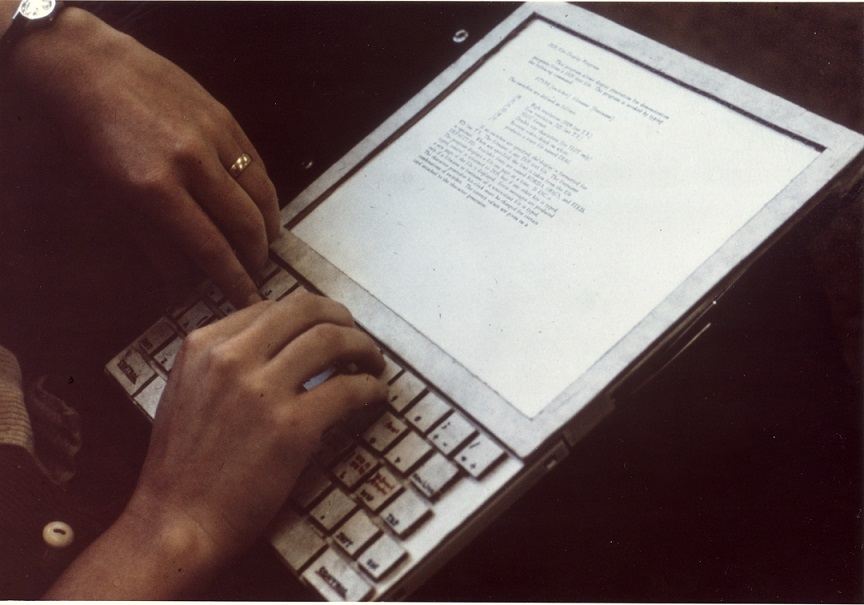

# Módulo 1: Introdução ao estudo de Interface Humano-Computador (IHC)

## Introdução

Vivemos em um mundo mergulhado em tecnologia, em que a interação com dispositivos de Tecnologia de Informação e Comunicação é questão quase essencial de sobrevivência, ou pelo menos de conforto. Para todo lugar que olhamos, existe uma interface querendo se comunicar conosco, seja um microondas, uma televisão, nosso smartphone, ou até a lanchonete onde comemos. Basta analisar um dia banal da nossa vida. Entre cama, banho, refeições, trabalho, entretenimento, descanso, com quantos objetos interativos temos que lidar? Ao interagir com meu chuveiro, ainda em um estado entorpecido por mais um noite mal dormida por causa do Netflix, demoro uns dois minutos pra conseguir a temperatura que eu quero!

Podemos avaliar a importância da interfaces pela grandiosidade do que o Smartphone fez pela popularização da tecnologia de informação. Descontados aí os acessos desnecessários, apenas para aplacar a ansiedade e espantar o tédio, percebam quantas vezes, e pra quantos tipos de tarefas, interagimos com o smartphone, através da voz e dos gestos com dedos. Além disso, imaginemos tantas pessoas que puderam exercer atividades das mais simples e banais, no contexto de uma pandemia, através da interação direta com dispositivos e interfaces. Se são amigáveis, não dá pra saber com precisão (até porque a qualidade de ser amigável é algo a se definir), mas que são úteis, não podemos negar. Através das interfaces é que o mundo tem funcionado a partir de 2020.

Transformações profundas como essas foram possibilitadas porque projetistas de interface com o usuário domaram a tecnologia para que ela servisse às necessidades dos seres humanos. Falamos aqui de uma ciência chamada de Interação Humano-Computador, que aplica métodos de psicologia experimental às ferramentas poderosas da computação, integrando lições de psicólogas educacionais e industriais, designers de produto/gráficos, escritores, especialistas em ergonomia, até antropólogos e sociólogas.

Em meados da década de 80, foi cunhado o termo **Interação Humano-Computador** (de agora em diante IHC) para definir esta nova área de estudo, cujo foco não era apenas o projeto de interface, mas todos os aspectos relacionados com a interação entre usuários e sistemas. Em determinado momento da história chegou-se à conclusão que a Interação é um termo mais amplo do que a Interface. Imagine um grande conjunto chamado interação que, para existir, necessita de um elemento que permita a comunicação – a interface. O resultado disso é que, entendendo a interação, será mais fácil projetar a interface.

A compreensão das necessidades, comportamentos e preferências dos usuários é fundamental no design de interfaces. Ao projetar um aplicativo de música, por exemplo, precisamos entender as preferências musicais dos usuários, como gêneros, artistas ou playlists favoritas. Isso nos permite criar uma interface que recomenda músicas relevantes e personalizadas, tornando a experiência musical mais agradável. Além disso, ao desenvolver jogos, é importante entender como os jogadores interagem com o ambiente virtual, quais ações realizam com mais frequência e quais elementos de design os mantêm engajados e entretidos.

A IHC abrange um amplo escopo, incluindo *interfaces do usuário, técnicas de interação, usabilidade, acessibilidade e experiência do usuário (UX)*. As **interfaces do usuário (UI)** são o ponto de contato entre as pessoas e os sistemas. Por exemplo, uma interface de um aplicativo de redes sociais, como o Instagram, permite que os usuários compartilhem fotos, curtam e comentem as postagens de amigos. 

As **técnicas de interação**, como toque, gestos e comandos de voz, tornam a interação com os sistemas mais naturais e intuitivas. 

Já a **usabilidade** está relacionada à facilidade de uso de um sistema, garantindo que os usuários possam realizar suas tarefas de maneira eficiente e sem frustrações.

A **acessibilidade** é um aspecto importante da IHC, garantindo que pessoas com diferentes habilidades possam utilizar os sistemas computacionais. Por exemplo, um site com recursos de acessibilidade adequados, como descrição de imagens para pessoas com deficiência visual, torna o conteúdo mais acessível. 

Por fim, a **experiência do usuário (UX)** considera as emoções, percepções e satisfação dos usuários durante a interação com um sistema. Por exemplo, ao projetar um aplicativo de compras online, é importante criar uma experiência agradável, desde a navegação intuitiva até o processo de pagamento simplificado.

Grande parte dos problemas com interfaces de sistemas interativos é que seu projeto muitas vezes é realizado de acordo com as tecnologias envolvidas. Quem nunca desenvolveu uma tela em que a caixa de opções é assim porque "no React é desse jeito"?  Vou chamar essa rotineira abordagem de *Technology-Centered Design* (TCD). É a famosa abordagem Kevin Costner: "Construa o sistema desse jeito mesmo que os usuários vêm...". Aliás, se você entendeu a referência, você está ficando velha. Senão, procura "Campo dos Sonhos filme" no Google. A prioridade do TCD é criar tecnologia capaz de preencher objetivos funcionais. Apenas em um estágio posterior do processo, depois do design da solução, os usuários são considerados. Infelizmente, esse feedback acaba vindo muito tarde. Aí, só resta melhorias cosméticas de design que não resolvem o problema. O que falta ao TCD é *empatia com o usuário*. 

Coloca-se como oposto disso a ideia de **User-Centered Design (UCD)**. A equipe de desenvolvimento, desde o início do projeto, se ocupa de responder às seguintes perguntas:
* Como usuários vão usar este sistema?
* Como eles veem o sistema, em comparação a sistemas similares?
* Como interagir com tal produto?
* Onde eles interagem com o produto, e em que circunstâncias?

O UCD observa e entrevista usuários, avalia mercado e competidores, usando todo o feedback para determinar as demandas necessárias em um sistema antes até que ele seja prototipado. Em vez de esperar que o processo chegue ao final para avaliar um produto completo, durante o desenvolvimento usuários representativos são consultados, testando protótipos e revisando resultados; *o sistema deve se moldar às necessidades, desejos e situações dos usuários*. Além disso, UCD continua a consultar os usuários depois da entrega, para melhorias. Muitas aplicações que usamos no nosso dia-a-dia incorporam esse protocolo no seu desenvolvimento, por isso recebemos tantas atualizações nos nossos smartphones, por exemplo.

Se temos um foco nesta disciplina, esse será a promoção do UCD.

### Desenvolvimento histórico

Um bom lugar para começar nossa história é em Julho de 1945, quando o engenheiro Vannevar Bush escreveu um artigo para o Atlantic Monthly, mais tarde reimpresso na revista Life, chamado "Como Nós Podemos Pensar". Considerando que a tecnologia tem sobretudo aumentado as habilidades físicas das pessoas - como uma faca, por exemplo -, Bush delineou uma visão para tecnologias da informação que aumentaria as habilidades intelectuais das pessoas. O objetivo deste artigo, escrito no final da Segunda Guerra Mundial, era perguntar "O que cientistas financiados pelo governo podem fazer para criar um mundo melhor em tempo de paz?" e sua visão era fortemente antropocentrica. Bush escreveu sobre uma futura mesa interativa; ele chamou o sistema de "Memex".

Nela todas as informações do mundo estariam disponíveis na área de trabalho dos trabalhadores do conhecimento. A chave para a ideia do Memex era interfaces eficazes para o armazenamento e a recuperação de informação. Lembre-se, estamos em 1945, portanto, ainda não existem os práticos computadores digitais — os primeiros computadores digitais, do tamanho de uma sala, estavam sendo construídos — e a ideia era usar microfichas - filme de alta densidade - para armazenar tudo! Ainda mais impressionante, a visão de Bush para o Memex inventou o hipertexto, esse negócio de links que conectam documentos relacionados que usamos hoje.

Ele teve essa ideia de que as pessoas poderiam criar trilhas através deste estoque de informações, salvá-las para usar mais tarde, e compartilhá-las com outros. Mas você nem sempre está na sua mesa, certo? Você quer que a tecnologia venha com você. E os trabalhadores do conhecimento precisam produzir conteúdo, bem como consumi-lo. E o mundo não é só textual, mas também visual. Então, Bush imaginou que, no futuro, você usaria uma câmera bem no centro de sua cabeça, como um terceiro olho, e a usaria para capturar as coisas. E ele elaborou um projeto que tornou isso tão fácil quanto possível para tirar fotos. Assim, não teria nenhum discador ou configuração para lidar. Assim como a mesa Memex, os detalhes ocorreram de forma diferente; mas a visão central ficou intacta. Hoje, por exemplo, há bilhões de smartphones com câmera que as pessoas carregam com elas. 

Os computadores digitais programáveis que logo vieram, como o ENIAC, foram uma enorme previsão tecnológica. Mas a interface com o usuário deixava muito a desejar. A ideia de fornecer uma interface mais eficaz aos computadores tem uma longa e lendária história, começando com a invenção do primeiro compilador, por Grace Hopper, no início da década de 1950. Ela conceituou como ferramentas aprimoradas poderiam fornecer acesso à computação a um público muito mais amplo. Nos anos seguintes, bons ambientes de programação para o desktop e Web permitiram que legiões de desenvolvedores criassem o conteúdo que ajudou a colocar um PC em cada mesa. 

É um longo caminho desde o trabalho visionário de Grace Hopper no compilador até a interface gráfica do usuário. As sementes da manipulação direta foram lançadas no Lincoln Labs da MIT por Ivan Sutherland. A principal inovação da interface gráfica é que a entrada do usuário é realizada diretamente sobre a saída do sistema.  Essa diretriz de entrada-saída faz a interface ser muito mais intuitiva e fácil de entender. No caso de Bloco de Notas de Sutherland, a entrada era uma caneta de luz e a saída era um osciloscópio. 

Em 1945, Doug Engelbart era um técnico de radar da Marinha, passando anos monótonos nas Filipinas. Na biblioteca, ele encontrou um exemplar da revista Life; copiou o artigo de Bush. A ideia de um dispositivo que poderia estender o poder da mente humana deixou Engelbart boquiaberto. Levou um longo tempo, mas finalmente ele recebeu algum financiamento e começou a trabalhar. E o que Doug Engelbart trouxe, ele mostrou ao mundo em sua famosa demonstração em 1968. 

Um trecho de seu discurso na demonstração: "O programa de pesquisa que eu vou descrever para vocês é rapidamente caracterizável , dizendo: se, em seu escritório, você, como um trabalhador intelectual, foi equipado com um monitor de computador, acompanhado por um computador que ficava ligado para você o dia inteiro, e era infinitamente sensível às reações que você tem, quanto valor que você extrairá disso? E em um instante você olhará a tela e ela está funcionando. E a maneira como o cursor move em conjunto com os movimentos do mouse."

O mouse de Engelbart funcionava com duas rodas ortogonais. Cada um era um potenciômetro, um resistor variável, assim como aparelhos de som geralmente têm em um botão de volume. Então você consegue girar em torno de 300º. O seu parâmetro utilizável fornecia cerca de 5 polegadas de movimento em cada direção.

Após a demonstração de 1968, Doug viajou pelos EUA com um projetor 16 milímetros da Bell & Howell. Ivan Sutherland tinha se juntado recentemente ao corpo docente da Universidade de Utah. Doug veio em visita e apresentou a demo, e na platéia estava o aluno de doutorado de Ivan, Alan Kay.
Alan vinha sonhando com um computador pessoal. Ele viu o vídeo de Engelbart e percebeu a conexão das ideias. Alan mudou-se para o Laboratório de AI da Stanford, onde o grupo de John McCarthy tinha um sistema de compartilhamento dos primeiros tempos, talvez o lugar no mundo onde cada pessoa tinha seu próprio terminal. De lá, ele foi para o lendário instituto de pesquisa Xerox PARC, onde dá vida à sua visão de um Dynabook.

Acima está uma foto do protótipo que Alan fez no início dos anos 1970. Este não é um computador funcional; ele é feito de papelão; é um protótipo desenhado para comunicar uma visão. Com esta visão em mãos, Alan Kay e seus colegas da Xerox PARC começaram a construir a fundação da primeira real interface gráfica do usuário . Eles levaram uma década para conseguir juntar tudo, para deixá-lo pronto para entrega. 

Em meio a isso, a Xerox lançou o sistema de computação STAR em 1981. O STAR possuía um display de bitmap, uma interface gráfica baseada em janelas, ícones, pastas, mouses, rede ethernet, servidores de arquivos, servidores de impressão e e-mail. Usando a tecla MOVE, você pode organizar sua área de trabalho da maneira que você gostar. Fazer uma cópia de um desses documentos em branco é como transformar uma folha de ofício em um bloco de papel. A capacidade dos usuários de produzirem seus próprios formulários é um exemplo da usabilidade incorporada ao sistema. A tela se aproxima bastante da aparência de uma página impressa. O STAR foi lançado quase quatro décadas após a visão de Vannevar Bush, três décadas depois do compilador de Grace Hopper, duas décadas depois do primeiro sistema de Doug Engelbart funcionar, e uma década depois de Alan Kay começar a trabalhar na construção deste computador, inspirado nas ideias do Dynabook.

Depois disso, vem Steve Jobs com o Macintosh, talvez roubando (ou pegando emprestado) algumas dessas coisas do XEROX Parc, e então Bill Gates com o Windows, e, décadas depois, computadores pessoais, portáteis e os smartphones.

### Importância 

Quando utilizamos um aplicativo de mensagens instantâneas, como o WhatsApp, por exemplo, há fatores de que, no dia a dia, não damos conta, mas que definem nossa experiência, como:

* A organização das conversas (imagine se elas estivessem em ordem alfabética?);
* Os ícones de envio de mensagens;
* Destaques de fonte e cores;
* Opções de personalização da interface, como notificações.
  
Qualquer decisão diferente teria feito você decidir não usar o aplicativo, escolhendo outro no lugar, mesmo esse sendo pior, ou mais lento. Um design bem pensado e intuitivo facilita a comunicação, agiliza a troca de mensagens e nos mantém conectados com as pessoas de forma mais eficiente. É por isso que a IHC é essencial para criar produtos que atendam às necessidades dos usuários e proporcionem uma experiência agradável.

Outro exemplo, ao utilizar um aplicativo de edição de fotos como o Adobe Photoshop, a disposição das ferramentas, os atalhos de teclado e as opções de edição afetam diretamente o fluxo de trabalho do usuário. 

Incorporar os princípios da IHC no processo de desenvolvimento de software traz diversos benefícios. A usabilidade é um desses benefícios, pois um design amigável e intuitivo reduz a curva de aprendizado, permitindo que os usuários aprendam a utilizar o software de forma mais rápida e eficiente. Por exemplo, a interface do Google Maps apresenta uma navegação intuitiva, com ícones claros e instruções passo a passo, o que facilita a utilização do aplicativo para encontrar rotas e explorar novos lugares. Além disso, a incorporação de princípios da IHC, como feedback visual e sonoro, contribui para o aumento do engajamento dos usuários, tornando a experiência mais envolvente e agradável. Um exemplo disso é o Spotify, que oferece recursos interativos, como playlists personalizadas e recomendações de músicas com base nos gostos do usuário, tornando a experiência de ouvir música mais cativante e satisfatória.

## Conceitos chave

### Fatores Humanos e Psicologia

Imagine-se criando um aplicativo de entrega de comida. Se você compreende que as pessoas têm habilidades diferentes, como pessoas com deficiências visuais ou motoras, a gente pode criar uma interface que seja acessível pra todo mundo. É possível considerar opções de contraste, tamanhos de fonte ajustáveis e até mesmo leitores de tela que leiam o conteúdo pro usuário. Assim, a gente garante que todos possam usar o aplicativo de forma fácil e inclusiva.
Quando a gente fala de fatores humanos, estamos falando de como as *características e habilidades das pessoas influenciam a interação com os computadores*. 

A psicologia Cognitiva é o ramo da Psicologia que trata do modo como os indivíduos percebem, aprendem, lembram e representam as informações que a realidade fornece.  Estudos enfatizam *percepção, pensamento e memória*. 
A cognição é o processo que toma lugar nas nossas mentes quando realizamos qualquer tipo de atividade: pensar, lembrar, aprender, fantasiar, tomar decisões, ver, ler, escrever e falar. 

Vamos discutir aqui alguns processos cognitivos. Vários estão envolvidos em uma determinada atividade - raramente ocorrem isoladamente. Por exemplo, quando você está lendo esse texto, você *percebe* as letras e palavras, usa a *memória* para entender os conceitos, fazendom a *leitura* para encontrar o sentido das frases, talvez exercendo a *tomada de decisão* e a *resolução de problemas*.

**Atenção**

Este processo envolve selecionar as coisas em que se concentrar, a partir de um conjunto de alternativas, permitindo o foco na informação que é relevante para o que você está fazendo. O sucesso desse processo depende de (1) o indivíduo ter os objetivos claros, e (2) o destaque da informação necessária no ambiente. 

Para (1), se alguém sabe do que precisa, este tenta casar esse objetivo com a informação disponível. Por exemplo, se você vai no portal UOL depois do jogo do seu time, seus olhos varrem a página procurando pelo escudo do clube e números destacados representando o placar. Por outro lado, se não há um objetivo predefinido, a navegação é mais importante. É só se ver em um restaurante em que você nunca esteve, escolhendo seu prato em um cardápio (hoje em dia, no QR Code, claro).

Para (2), é evidente que o jeito que a informação está mostrada tem grande influência na compreensão dessa informação. Organização, destaque, cores, tudo isso tem grande influência.

Outra questão importante é o efeito da necessidade moderna de sermos *multi-tarefa* no processo de atenção. Existem vários estudos científicos sobre o efeito de múltiplas tarefas simultâneas sobre memória e atenção; em geral, depende da natureza da tarefa e do quanto de atenção ela demanda. Diferenças individuais também são fatores. Você consegue escutar música enquanto estuda? E enquanto lava louça?

Mas resultados sugerem que várias tarefas dificultam o foco. E vivemos em um mundo em que nossa atenção está cada vez mais fragmentada, por vários motivos - o smartphone é o vilão mais citado. Um exemplo: estudantes que estavam interagindo com mensagens demoraram 50% mais tempo para ler e entender um texto, comparados com outros que estavam apenas lendo sem smartphone. Resultados de um mundo multi-tarefa incluem perder fio de raciocínio, cometer erros e necessidade de recomeçar. Os usuários de sistemas estão nesse contexto; design da interação deve levar isso em consideração.

Implicações da limitação de atenção para design de sistemas:
* Informação precisa ser destacada quando ela requer atenção em um dado momento;
* Para isso, usa-se animação, cores, ênfases, ordenação, sequenciamento de informação e espaçamento;
* Evita-se sobrepor muita informação em interfaces visuais - em vez de atenção, distração e irritação.
* Suporte à troca efetiva entre interfaces para multi-tarefa.

**Percepção**

Entende-se percepção como a forma de adquirir informação via cinco sentidos (visão, audição, paladar, olfato e tato), transformando-a em experiências com objetos e eventos. Para o design da interação, é importante apresentar informação de forma que seja facilmente percebida da forma como foi projetada. Por exemplo, agrupar itens em conjunto e deixando espaços entre eles pode ajudar a perceber a estrutura da informação. 

Implicações para design de sistemas:
* Ícones e outras representações gráficas devem ser distinguíveis;
* Separadores óbvios e espaços em branco são efetivos em agrupar informação, facilitando identificação e localização;
* Sons devem ser distinguíveis entre si, remetendo a informação correta;
* Contraste de cores para correta identificação;
* Feedback de toque pode ser usado em vários contextos, no entanto devem ser diferenciável.

**Memória**

Memória é lembrar de vários tipos de conhecimento, permitindo alguma ação: saber onde está determinado comando no menu, ou saber os comandos Git na linha de comando. Somos afetados pela sobrecarga de informação; nosso cérebro coloca em ação algum mecanismo de filtro para decidir que informação processar e memorizar. Ainda assim, esse filtro acaba falhando - vivenciamos isso quando esquecemos nossa senha do banco no caixa eletrônico, com 10 pessoas na fila esperando por você.

De forma bastante rudimentar, podemos entender o processo como dependente da atenção e da percepção. Quanto mais prestamos atenção em algo, o quanto mais o processarmos em termos de raciocínio, comparando-o com outros conhecimentos, mais provável será nos lembrarmos disso.

Cada vez mais, tendemos a depender da internet e do Smarphone como "apoios cognitivos", algo como uma extensão da mente. Todo mundo hoje tem algum tipo de "sistema de informação pessoal", através de ferramentas de informação. Qual é o seu?

Implicações para design de sistemas:
* Redução da carga cognitiva ao evitar procedimentos longos e complicados;
* A priorização do *reconhecimento* à necessidade de *lembrança*, usando padrões de interação, menus, ícones familiares;
* É bom sempre oferecer modos variados de identificar objetos digitais (cores, nomes, tags, ícones, folders).

**Aprendizado**

Bastante relacionado com a memória, aprendizado define a acumulação de habilidades e conhecimento. Sem a memória não há aprendizado, e talvez possamos dizer que sem aprendizado também há pouca memória. Na psicologia cognitiva, o aprendizado acontece de duas formas: incidental ou intencional, de nomes autoexplicativos. No primeiro caso, reconhecimento de rostos, ruas e objetos. Já no segundo, assunto de uma prova, ou a habilidade de cozinhar. Este é bem mais difícil, por isso desenvolvedores de software não podem assumir que usuários vão facilmente  aprender a usar um aplicativo que requer esforço consciente significativo. 

Além disso, as pessoas preferem aprender usando qualquer coisa a ler manuais. Interfaces devem ter o papel de fomentar o aprendizado ativo, dando suporte à interação exploratória e sem medo de cometer erros. Dá pra imaginar sistemas sem Control+Z?

Implicações para design de sistemas:
* Interfaces devem encorajar a exploração;
* Interfaces devem restringir e guiar usuários a selecionar ações apropriadas quando aprendem.

**Ler, ouvir e falar**

São as três formas de processamento de linguagem; no entanto, a facilidade com que pessoas as exercem depende do indivíduo, da tarefa e do contexto. Muitas pessoas estão impossibilitadas de ouvir, por isso só podem ler, ou o oposto. Uma interface pode ser baseada em sons, no entanto o sistema poderia ser acessado por um computador com a saída de som quebrada. 

Outros aspectos a considerar: a linguagem escrita é permanente, enquanto o áudio é transiente; reler é fácil, reescutar pode não ser possível. Ler pode ser mais rápido que falar ou ouvir, apesar de que ouvir requer um esforço cognitivo menor. 

Implicações para design de sistemas:
* Menus e recomendações em áudio precisam ser usados de forma limitada;
* É necessário dar a opção de aumentar textos na tela, de uma forma fácil, sem modificar a formatação geral.

**Resolução de problemas, planejamento, raciocínio e tomada de decisão**

Aqui incluem-se pensar sobre o que você deve fazer, quais são as opções disponíveis, e quais são as consequências de cada ação. Em geral envolve processos conscientes (cognição reflexiva), discussão (até com você mesmo), e o uso de artefatos adicionais (caneta, mapas, livros, papel).

Teorias mais antigas sobre a tomada de decisão professavam que isso normalmente inclui pesar todos os custos e benefícios das diferentes opções. Empiricamente, a psicologia cognitiva tem mostrado que as pessoas tendem a usar heurísticas simples para decidir - nossa mente evoluiu para tomar decisões rápidas e "suficientemente boas", ignorando boa parte da informação disponível e confiando em algumas poucas pistas. Por exemplo, num supermercado, fazemos julgamentos de compra baseados em marcas reconhecidas ou pelo empacotamento vistoso, sem olhar qualquer outra informação. 

No design, por isso torna-se crítico evidenciar informações chave. Melhor que oferecer muitas informações é projetar intervenções tecnológicas que oferecem pouca informação, da melhor forma, facilitando as decisões positivas. 

Implicações para design de sistemas:
* Oferecer informação e ajuda fáceis de acessar;
* Empregar funções simples e memoráveis para dar suporte à tomada rápida de decisões;
* O usuário deve ter como definir suas próprias preferências e critérios;

**Modelos Mentais**

A gente tem coisas como **modelos mentais**, que são aquelas representações que a gente cria na nossa cabeça sobre como as coisas funcionam. Pensa no Instagram, por exemplo. Quando você entra no aplicativo, você já sabe intuitivamente que pode rolar a tela pra baixo pra ver mais posts, né? Isso é um exemplo de como a interface foi projetada levando em conta os nossos modelos mentais. 

Podemos também pode usar esses conhecimentos de fatores humanos e psicologia cognitiva pra criar *interfaces específicas pra diferentes grupos de usuários*. Por exemplo, podemos considerar em interfaces adaptadas pra pessoas mais velhas, que podem ter dificuldade com leitura pequena ou botões muito pequenos. Ou então interfaces pensadas pra pessoas com deficiências motoras, que talvez prefiram usar comandos de voz ou gestos em vez de toques na tela. A ideia é criar interfaces que respeitem as habilidades e limitações de cada pessoa, pra que todo mundo possa aproveitar a tecnologia de forma plena e sem barreiras.

Na psicologia cognitiva, modelos mentais são definidos como construções internas manipuláveis de algum aspecto do mundo externo, permitindo que sejam feitas predições e inferências, muitas vezes através de analogias. 

Considerações para o design: 
* A grande diferença entre os modelos mentais desenvolvidos por usuários novatos e por experientes.
* As diferenças de modelos mentais entre indivíduos, segundo as funções por eles exercidas, de gestão ou de operação, por exemplo. Neste caso, são evidentes as diferenças nas representações mentais de quem opera um sistema assídua e frequentemente, de quem o faz de maneira esporádica ou intermitente;
* Os modelos mentais relativos a uma interface correspondem a um conjunto de conhecimentos semânticos (conceitos) e procedurais (procedimentos) que é particular a cada usuário;
* Os modelos mentais desenvolvidos por projetistas e por usuários se diferenciam grandemente.

### Princípios de Usabilidade e UCD

Usabilidade é aquela característica que torna um sistema ou interface fácil de utilizar. É quando a gente consegue realizar nossas tarefas de forma eficiente, sem perder tempo procurando onde clicar ou ficando confusos com as opções. Vamos considerar o aplicativo do Instagram: quando a gente abre o app, a gente consegue navegar pelas fotos, comentar, curtir e postar sem dificuldade, né? Isso é resultado de um design com boa usabilidade. A gente quer que os usuários se sintam à vontade e consigam usar um sistema sem precisar de um manual de instruções!

Além disso, a usabilidade é composta por três componentes fundamentais: *eficácia, eficiência e satisfação*. A **eficácia** está relacionada à capacidade do usuário de atingir seus objetivos utilizando o sistema. Por exemplo, em um aplicativo de entrega de comida, a eficácia seria o usuário conseguir fazer o pedido corretamente e receber a comida no endereço certo. Já a **eficiência** é sobre fazer isso de forma rápida e com o mínimo de esforço. Por fim, a **satisfação** está ligada à experiência geral do usuário, como se ele gostou da interface, se teve uma boa interação e se ficou satisfeito com o resultado final.

Hoje, as equipes de desenvolvimento de software têm a noção de que, para atingir altos índices de usabilidade, é importante seguir as diretrizes de um _design centrado no usuário (UCD)_. Essa abordagem coloca o usuário como o foco principal de todo o processo de design. A ideia é entender as necessidades, expectativas e desejos dos usuários desde o início e criar soluções que atendam a essas demandas. Por exemplo, se a gente está desenvolvendo um aplicativo de música, a gente precisa entender os gostos musicais dos usuários, as funcionalidades que eles esperam encontrar e como eles gostariam de interagir com o aplicativo. A partir dessas informações, a gente cria um design que seja realmente útil e agradável para o público-alvo.

E olha só, uma das coisas legais do design centrado no usuário é que ele é _iterativo_. Isso significa que a gente faz testes, recebe feedback dos usuários e faz melhorias constantes ao longo do processo de design. Por exemplo, quando a gente lança um novo aplicativo de mensagens, a gente pede para os usuários experimentarem e nos contar o que eles acharam. Se eles tiverem dificuldades em encontrar os contatos ou enviar mensagens, a gente volta ao processo de design e faz ajustes para tornar a experiência mais fluída e intuitiva.

### Affordances e restrições

**Affordances**! Vocês já ouviram falar disso? É um termo difícil de traduzir. Affordances são aquelas características das interfaces que nos dão dicas sobre como interagir e entender as funcionalidades.

Sabe quando você vê um botão em um aplicativo de música, como o Spotify, com uma seta apontando para a direita? Essa seta é uma affordance, ela nos diz que podemos clicar nesse botão para ir para a próxima música. É como se a interface estivesse nos mostrando uma pista de que ali tem uma funcionalidade que podemos usar. Outro exemplo é o gesto de deslizar o dedo na tela para rolar uma lista. Quando a gente faz esse gesto no Instagram, a gente entende que pode explorar mais conteúdo além do que está visível na tela. Essas são algumas formas de affordances que nos ajudam a entender como interagir com as interfaces.

As affordances precisam estar acompanhadas de **constraints**, que são como regras ou limitações que orientam o comportamento do usuário. Quando você está usando um aplicativo de edição de fotos, como o Snapseed, e tem uma opção de cortar a imagem, você vai ver uma caixa delimitando a área de corte. Essa caixa é uma constraint, ela nos mostra que só podemos cortar a imagem dentro dessa área específica. Assim, a interface nos guia e nos impede de fazer cortes indesejados. Outro exemplo são os botões que mudam de cor ou têm uma animação quando clicamos neles. Isso é uma constraint visual que nos mostra que o clique foi reconhecido e que a ação está em processo.

### Satisfação e UX

A **satisfação** do usuário está relacionada com a sensação de _prazer, contentamento e cumprimento de suas expectativas_ ao interagir com um sistema. Quando você usa o iFood, você quer que a experiência de ter uma refeição acontecendo de forma rápida, sem complicações com o pagamento ou com a entrega. E se ocorreu algo errado com a entrega, você quer ficar satisfeito com a forma como o problema será resolvido através do aplicativo.

O que influencia a nossa satisfação? Vários fatores entram em jogo, como a facilidade de uso do sistema, a eficiência na realização das tarefas, o design atraente e intuitivo, a clareza das informações apresentadas e até mesmo a confiabilidade do sistema. Tudo isso contribui para que a gente se sinta bem ao usar o sistema e tenha uma experiência positiva.

E quando falamos de **experiência do usuário** (UX), estamos falando de um conjunto de elementos que contribuem para uma experiência geral positiva. Além da satisfação, a UX envolve a usabilidade, a estética, as emoções despertadas e até mesmo o contexto em que a interação ocorre. No Spotify, ou em outros aplicativos de música, a interface agradável, os recursos personalizados, a possibilidade de descobrir novas músicas e até mesmo as playlists temáticas contribuem para uma experiência do usuário completa e envolvente. A gente se sente satisfeito ao usar o aplicativo, porque ele nos proporciona momentos de diversão, descoberta e conexão com a música.

Agora, como medir e avaliar a satisfação do usuário e a UX? Existem várias técnicas que podemos utilizar, como pesquisas de satisfação, questionários, entrevistas e até mesmo análise de dados de uso. Por exemplo, a gente pode enviar um questionário aos usuários de um aplicativo de streaming de vídeo, como a Netflix, perguntando sobre a qualidade do serviço, a facilidade de navegação, as sugestões de conteúdo e a satisfação geral. Essas informações nos ajudam a entender o que está funcionando bem e o que pode ser melhorado na experiência do usuário. Também podemos utilizar técnicas de teste de usabilidade, observando os usuários enquanto eles interagem com o sistema e coletando feedback em tempo real. Vamos falar mais sobre essas técnicas ao longo da disciplina.

## Teorias e Modelos

Apenas alguns exemplos, já que existe muitas teorias e modelos usados pelo design de interação. Várias das técnicas que vamos investigar aqui usam essas teorias como inspiração ou fundamento.

### Fitts' Law e Hick's Law

A **Lei de Fitts** estabelece uma relação entre a distância até um alvo e o tamanho desse alvo, influenciando o tempo necessário para alcançá-lo com precisão. Se você estiver usando um mouse ou usando o dedo em um tablet, a regra é clara, Arnaldo: _quanto mais distante o alvo estiver e menor for o seu tamanho, mais tempo levará para acertar o alvo_. 

Imagine-se desenvolvendo um aplicativo de mensagens. Queremos garantir que a interação com os elementos da interface seja fácil e intuitiva, e é aí que a Lei de Fitts entra em ação. Podemos aplicar a Lei de Fitts para melhorar a usabilidade dos botões e ícones interativos no aplicativo. Por exemplo, se o botão de envio de mensagem for pequeno e estiver posicionado em um canto distante da tela, isso pode dificultar a interação. Aplicando a Lei de Fitts, podemos aumentar o tamanho do botão de envio de mensagem e posicioná-lo de forma estratégica, preferencialmente próximo à área onde o usuário está digitando a mensagem. Dessa forma, o botão se torna mais fácil de alcançar, reduzindo o esforço necessário para interagir com ele.

Outro exemplo é a utilização de links ou botões em um aplicativo de notícias. Se os links estiverem muito próximos uns dos outros e forem pequenos, pode ser difícil acertar o link desejado e o usuário pode acabar clicando no link errado. Nesse caso, aplicando a Lei de Fitts, podemos aumentar o espaço entre os links e aumentar o tamanho de cada link para facilitar o clique preciso.

Ao utilizar a Lei de Fitts, estamos tornando a interação com o aplicativo mais intuitiva e eficiente. Aumentando o tamanho dos alvos e reduzindo a distância até eles, estamos facilitando o acesso e evitando cliques acidentais. Isso contribui para uma melhor experiência do usuário e diminui a probabilidade de erros de interação.

Já a **Lei de Hick** estabelece uma relação entre o número de opções disponíveis e o tempo necessário para tomar uma decisão. Quanto mais opções tivermos, mais tempo levará para tomar uma decisão. Em um aplicativo de música, por exemplo, você pode aplicar a Lei de Hick para melhorar a usabilidade dos menus e opções de navegação no aplicativo. Se oferecermos uma lista enorme de gêneros musicais para o usuário escolher, isso pode sobrecarregar a decisão e dificultar a localização da música desejada. Aplicando a Lei de Hick, podemos simplificar as opções de navegação, agrupar os gêneros musicais em categorias principais e oferecer uma busca por palavras-chave. Dessa forma, o usuário terá menos opções para analisar e tomará decisões mais rapidamente.

Outro exemplo é a utilização de menus suspensos em um aplicativo de edição de fotos. Se oferecermos uma longa lista de filtros e efeitos especiais sem qualquer organização, o usuário terá que percorrer todas as opções para encontrar o que deseja. Nesse caso, aplicando a Lei de Hick, podemos agrupar os filtros em categorias e fornecer uma visualização prévia para ajudar o usuário a escolher rapidamente.

### Norman's Model of Interaction

Don Norman, em seu livro clássico "Design of Everyday Things", que, mesmo feito para designers em geral, teve uma influência absurda no design de interfaces computacionais, enuncia o seu **modelo de interação** (ou *sete estágios de ação*). Este propõe uma abordagem centrada no usuário, levando em consideração as três camadas principais da interação: _execução, avaliação e formação de metas_ (abaixo, figura representando o ciclo). 

O modelo de interação de Norman é composto por duas partes: **o Golfo da Execução e o Golfo da Avaliação**. O Golfo da Execução se refere à distância entre as intenções e as ações do usuário, ou seja, como ele executa as tarefas no sistema. Já o Golfo da Avaliação é a distância entre as informações fornecidas pelo sistema e a compreensão do usuário, ou seja, como ele avalia o feedback recebido.

No Golfo da Execução, é importante que a interface forneça um mapeamento claro entre as ações que o usuário deseja executar e as opções disponíveis. Por exemplo, em um aplicativo de edição de fotos, se o usuário quiser aplicar um filtro, é importante que o sistema apresente claramente onde essa opção está e como ativá-la. Além disso, é fundamental fornecer feedback imediato para que o usuário perceba que a ação foi concluída com sucesso.

Já no Golfo da Avaliação, a interface deve fornecer um feedback claro e compreensível para que o usuário possa avaliar se o sistema atendeu às suas expectativas. No Ifood, é importante informar ao usuário o status do seu pedido, como o tempo estimado de entrega e as atualizações em tempo real. Isso permite que o usuário avalie se o serviço está cumprindo o que foi prometido.

Para ilustrar o modelo de Norman, podemos explorar exemplos práticos. Considere um aplicativo de streaming de música. No Golfo da Execução, o sistema deve oferecer uma interface intuitiva, com botões claros e bem posicionados para que o usuário possa facilmente reproduzir, pausar ou pular uma música. No Golfo da Avaliação, o sistema deve fornecer informações sobre a música em reprodução, como nome do artista, título da música e capa do álbum, para que o usuário possa avaliar se é a música desejada.

Outro exemplo é um aplicativo de compras online. No Golfo da Execução, o sistema deve apresentar categorias de produtos bem organizadas e filtros de pesquisa eficientes para que o usuário possa facilmente encontrar o que está procurando. No Golfo da Avaliação, é importante fornecer avaliações de outros usuários, informações detalhadas sobre o produto, como descrição e fotos, e um processo de checkout claro e seguro para que o usuário possa avaliar se o produto atende às suas expectativas.

## Considerações Éticas

Ao projetar interfaces, os designers podem se deparar com dilemas éticos, ou seja, situações em que precisam tomar decisões sobre o que é certo ou errado. Imagine (numa situação hipotética, ok?) um aplicativo de redes sociais que incentiva os usuários a compartilharem informações pessoais sensíveis em troca de benefícios ou recompensas. Aqui, designers precisam refletir sobre a ética de incentivar esse tipo de compartilhamento, considerando a privacidade e a segurança dos usuários.

Outro aspecto ético importante é o uso de técnicas de design persuasivo e dark patterns. O _design persuasivo_ busca influenciar o comportamento dos usuários, seja incentivando a compra de um produto, seja aumentando o tempo gasto em um aplicativo. No entanto, é essencial considerar até que ponto essas técnicas estão sendo usadas de forma ética. O uso de _dark patterns_, que são estratégias enganosas para manipular os usuários, é particularmente preocupante. Por exemplo, um aplicativo que dificulta o cancelamento de uma assinatura pode ser considerado antiético, pois vai contra a transparência e a liberdade de escolha do usuário.

Além disso, é importante refletir sobre o conceito de _manipulação do usuário e suas implicações éticas_. Manipular o usuário é influenciar suas ações de forma oculta ou sem o seu consentimento consciente. Por exemplo, um aplicativo de jogos que usa estratégias para viciar o usuário, levando-o a gastar dinheiro excessivo ou tempo além do saudável, pode ser considerado antiético. Os designers têm a responsabilidade de criar interfaces que promovam a tomada de decisões informadas e respeitem a autonomia do usuário.

