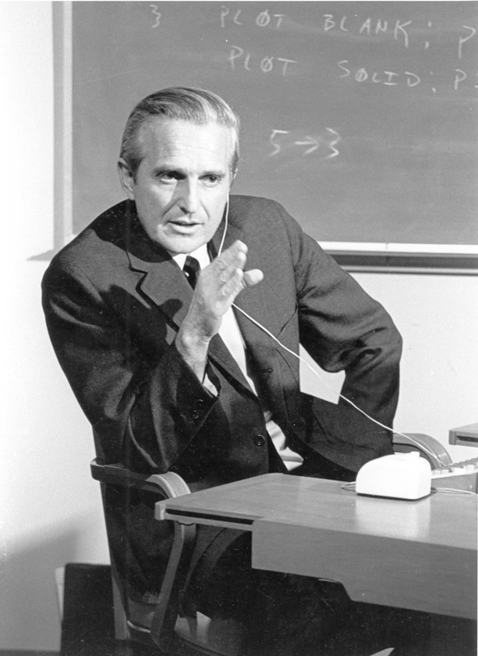
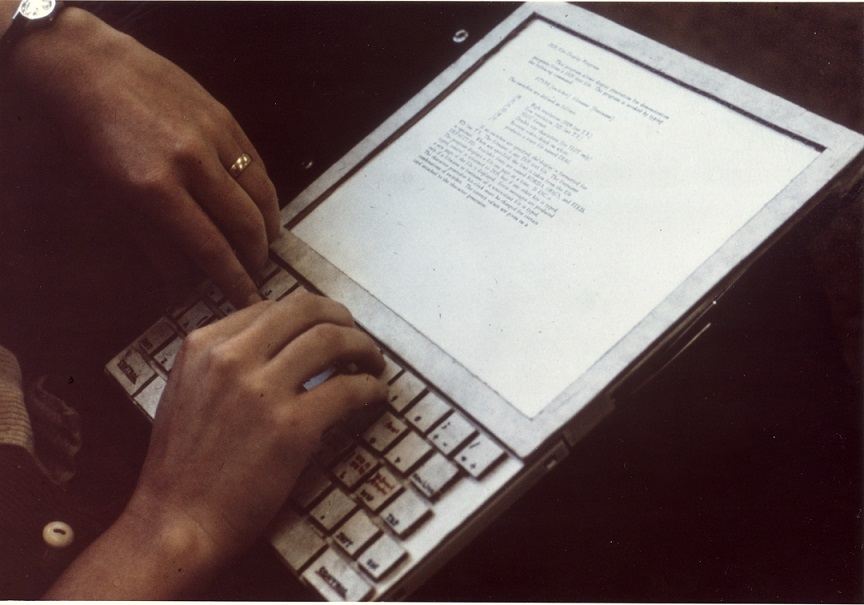

Vivemos em um mundo mergulhado em tecnologia, em que a interação com dispositivos de Tecnologia de Informação e Comunicação é questão quase essencial de sobrevivência, ou pelo menos de conforto. Para todo lugar que olhamos, existe uma interface querendo se comunicar conosco, seja um microondas, uma televisão, nosso smartphone, ou até a lanchonete onde comemos. Basta analisar um dia banal da nossa vida. Entre cama, banho, refeições, trabalho, entretenimento, descanso, com quantos objetos interativos temos que lidar? Ao interagir com meu chuveiro, ainda em um estado entorpecido por mais um noite mal dormida, demoro uns dois minutos pra conseguir a temperatura que eu quero! Para isso, tenho que entender como o chuveiro "conversa" comigo, ou seja, como ele entende meu comando para mudar a temperatura. (No meu caso, a interação se dá através de uma combinação de duas ações: abrir/fechar registro da água e regulagem do termostato em formato de bastão que fica ao lado do chuveiro. Talvez, no futuro, seja através de comandos de voz, ou até do pensamento!)

Podemos avaliar a importância da interfaces pela grandiosidade do que o Smartphone fez pela popularização da tecnologia de informação. Descontados aí os acessos desnecessários, apenas para aplacar a ansiedade e espantar o tédio, percebam quantas vezes, e pra quantos tipos de tarefas, interagimos com o smartphone, através da voz e dos gestos com dedos. Além disso, imaginemos tantas pessoas que puderam exercer atividades das mais simples e banais, no contexto de uma pandemia, através da interação direta com dispositivos e interfaces. Se são amigáveis, não dá pra saber com precisão (até porque a qualidade de ser amigável é algo a se definir), mas que são úteis, não podemos negar. Através das interfaces é que o mundo funcionou nos meses da COVID-19.

Transformações profundas como essas foram possíveis porque projetistas de interface com o usuário domaram a tecnologia para que ela servisse às necessidades dos seres humanos. No caso do chuveiro, o termostato só tem o formato de bastão porque alguém _estudou pessoas usando o chuveiro_ e pensou na melhor solução, aquela que iria permitir que essas pessoas usassem o chuveiro de forma eficiente, sem ter que memorizar um conjunto complexo de instruções. Falamos aqui de uma ciência que aplica métodos de psicologia experimental às ferramentas poderosas da computação, integrando lições de psicólogas educacionais e industriais, designers de produto/gráficos, escritores, especialistas em ergonomia, até antropólogos e sociólogas.

Em meados da década de 80, foi cunhado o termo **Interação Humano-Computador** (de agora em diante **IHC**) para definir esta nova área de estudo, cujo foco não era apenas o projeto de interface, mas todos os aspectos relacionados com a interação entre usuários e sistemas. Em determinado momento da história chegou-se à conclusão que a Interação é um termo mais amplo do que a Interface. Imagine um grande conjunto chamado interação que, para existir, necessita de um elemento que permita a comunicação – a interface. O resultado disso é que, entendendo a interação, será mais fácil projetar a interface.

A compreensão das _necessidades, comportamentos e preferências_ dos usuários é fundamental no design de interfaces. Ao projetar um aplicativo de música, por exemplo, precisamos entender as preferências musicais dos usuários, como gêneros, artistas ou playlists favoritas. Isso nos permite criar uma interface que recomenda músicas relevantes e personalizadas, tornando a experiência musical mais agradável. Em outro exemplo, ao desenvolver jogos, é importante entender como os jogadores interagem com o ambiente virtual, quais ações realizam com mais frequência e quais elementos de design os mantêm engajados e entretidos.

A IHC abrange um amplo escopo, incluindo _interfaces do usuário, técnicas de interação, usabilidade, acessibilidade e experiência do usuário (UX)_. As **interfaces do usuário (UI)** são o ponto de contato entre as pessoas e os sistemas. Por exemplo, uma interface de um aplicativo de redes sociais, como o Instagram, permite que os usuários compartilhem fotos, curtam e comentem as postagens de amigos, através de um tela de toque combinada a comandos de voz e movimentos do aparelho.

As **técnicas de interação**, como toque, gestos e comandos de voz, tornam a interação com os sistemas mais naturais e intuitivas.
Já a **usabilidade** está relacionada à facilidade de uso de um sistema, garantindo que os usuários possam realizar suas tarefas de maneira eficiente e sem frustrações.
A **acessibilidade** é um aspecto importante da IHC, garantindo que pessoas com diferentes habilidades possam utilizar os sistemas computacionais. Por exemplo, um site com recursos de acessibilidade adequados, como descrição de imagens para pessoas com deficiência visual, torna o conteúdo mais acessível.
Por fim, a **experiência do usuário (UX)** considera as emoções, percepções e satisfação dos usuários durante a interação com um sistema. Por exemplo, ao projetar um aplicativo de compras online, é importante criar uma experiência agradável, desde a navegação intuitiva até o processo de pagamento simplificado.

Grande parte dos problemas com interfaces de sistemas interativos é que seu projeto muitas vezes é realizado de acordo com as tecnologias envolvidas. Quem nunca desenvolveu uma tela em que a caixa de opções é assim porque "no React é desse jeito"? Vou chamar essa rotineira abordagem de _Technology-Centered Design_ (TCD). É a famosa abordagem Kevin Costner: "Construa o sistema desse jeito mesmo, que os usuários vêm...". (Se você entendeu a referência, você está ficando velha. Senão, procura "Campo dos Sonhos filme" no Google.) A prioridade do TCD é criar tecnologia capaz de preencher objetivos funcionais. Apenas em um estágio posterior do processo, depois do design da solução, os usuários são considerados. Infelizmente, esse feedback acaba vindo muito tarde. Aí, só resta melhorias cosméticas de design que não resolvem o problema. O que falta ao TCD é _empatia com quem vai usar o sistema_.

Coloca-se como oposto disso a ideia de **User-Centered Design (UCD)**. A equipe de desenvolvimento, desde o início do projeto, se ocupa de responder às seguintes perguntas:

- Como usuários vão usar este sistema?
- Como eles veem o sistema, em comparação a sistemas similares?
- Como interagir com tal produto?
- Onde eles interagem com o produto, e em que circunstâncias?

O UCD observa e entrevista usuários, avalia mercado e competidores, usando todo o feedback para determinar as demandas necessárias em um sistema antes até que ele seja prototipado. Em vez de esperar que o processo chegue ao final para avaliar um produto completo, durante o desenvolvimento usuários representativos são consultados, testando protótipos e revisando resultados; _o sistema deve se moldar às necessidades, desejos e situações dos usuários_. Além disso, UCD continua a consultar os usuários depois da entrega, para melhorias. Muitas aplicações que usamos no nosso dia-a-dia incorporam esse protocolo no seu desenvolvimento, por isso recebemos tantas atualizações nos nossos smartphones, por exemplo.

Se temos um foco nesta disciplina, esse será a _promoção do UCD_.

### Importância

Quando utilizamos um aplicativo de mensagens instantâneas, como o WhatsApp, por exemplo, há fatores de que, no dia a dia, não damos conta, mas que definem nossa experiência, como:

- A organização das conversas (imagine se elas estivessem em ordem alfabética?);
- Os ícones de envio de mensagens;
- Destaques de fonte e cores;
- Opções de personalização da interface, como notificações.

Qualquer decisão diferente teria feito você decidir não usar o aplicativo, escolhendo outro no lugar, mesmo esse sendo pior, ou mais lento. Um design bem pensado e intuitivo facilita a comunicação, agiliza a troca de mensagens e nos mantém conectados com as pessoas de forma mais eficiente. É por isso que a IHC é essencial para criar produtos que atendam às necessidades dos usuários e proporcionem uma experiência agradável.

Outro exemplo, ao utilizar um aplicativo de edição de fotos como o Adobe Photoshop, a disposição das ferramentas, os atalhos de teclado e as opções de edição afetam diretamente o fluxo de trabalho do usuário.

Incorporar os princípios da IHC no processo de desenvolvimento de software traz diversos benefícios. A _usabilidade_ é um desses benefícios, pois um design amigável e intuitivo reduz a curva de aprendizado, permitindo que os usuários aprendam a utilizar o software de forma mais rápida e eficiente. Por exemplo, a interface do Google Maps apresenta uma navegação intuitiva, com ícones claros e instruções passo a passo, o que facilita a utilização do aplicativo para encontrar rotas e explorar novos lugares. Além disso, a incorporação de princípios da IHC, como feedback visual e sonoro, contribui para o aumento do engajamento dos usuários, tornando a experiência mais envolvente e agradável. Um exemplo disso é o Spotify, que oferece recursos interativos, como playlists personalizadas e recomendações de músicas com base nos gostos do usuário, tornando a experiência de ouvir música mais cativante e satisfatória.

### Desenvolvimento histórico

Um bom momento para começar a história da IHC é Julho de 1945, quando o engenheiro Vannevar Bush escreve um artigo para o Atlantic Monthly, mais tarde reimpresso na revista Life, chamado "Como Nós Podemos Pensar". Considerando que a tecnologia tem sobretudo aumentado as habilidades físicas das pessoas - como uma faca, por exemplo -, Bush delineou uma visão para tecnologias da informação que aumentaria as habilidades intelectuais das pessoas. O objetivo deste artigo, escrito no final da Segunda Guerra Mundial, era perguntar "O que cientistas financiados pelo governo podem fazer para criar um mundo melhor em tempo de paz?" e sua visão era fortemente antropocêntrica. Bush escreveu sobre uma futura mesa interativa; ele chamou o sistema de "Memex".

Nela todas as informações do mundo estariam disponíveis na área de trabalho dos trabalhadores do conhecimento. A chave para a ideia do Memex era interfaces eficazes para o armazenamento e a recuperação de informação. Lembre-se, estamos em 1945, portanto, ainda não existem os práticos computadores digitais — os primeiros computadores digitais, do tamanho de uma sala, estavam sendo construídos — e a ideia era usar microfichas - filme de alta densidade - para armazenar tudo! Ainda mais impressionante, a visão de Bush para o Memex inventou o hipertexto, esse negócio de links que conectam documentos relacionados que usamos hoje.

Ele teve essa ideia de que as pessoas poderiam criar trilhas através deste estoque de informações, salvá-las para usar mais tarde, e compartilhá-las com outros. Mas você nem sempre está na sua mesa, certo? Você quer que a tecnologia venha com você. E os trabalhadores do conhecimento precisam produzir conteúdo, bem como consumi-lo. E o mundo não é só textual, mas também visual. Então, Bush imaginou que, no futuro, você usaria uma câmera bem no centro de sua cabeça, como um terceiro olho, e a usaria para capturar as coisas. E ele elaborou um projeto que tornou isso tão fácil quanto possível para tirar fotos. Assim, não teria nenhum discador ou configuração para lidar. Assim como a mesa Memex, os detalhes ocorreram de forma diferente; mas a visão central ficou intacta. Hoje, por exemplo, há bilhões de smartphones com câmera que as pessoas carregam com elas.

Os computadores digitais programáveis que logo vieram, como o ENIAC, foram uma enorme previsão tecnológica. Mas a interface com o usuário deixava muito a desejar. A ideia de fornecer uma interface mais eficaz aos computadores tem uma longa e lendária história, começando com a invenção do primeiro compilador, por Grace Hopper, no início da década de 1950. Ela conceituou como ferramentas aprimoradas poderiam fornecer acesso à computação a um público muito mais amplo. Nos anos seguintes, bons ambientes de programação para o desktop e Web permitiram que legiões de desenvolvedores criassem o conteúdo que ajudou a colocar um PC em cada mesa.

É um longo caminho desde o trabalho visionário de Grace Hopper no compilador até a interface gráfica do usuário. As sementes da manipulação direta foram lançadas no Lincoln Labs da MIT por Ivan Sutherland. A principal inovação da interface gráfica é que a entrada do usuário é realizada diretamente sobre a saída do sistema. Essa diretriz de entrada-saída faz a interface ser muito mais intuitiva e fácil de entender. No caso de Bloco de Notas de Sutherland, a entrada era uma caneta de luz e a saída era um osciloscópio.

Em 1945, Doug Engelbart era um técnico de radar da Marinha, passando anos monótonos nas Filipinas. Na biblioteca, ele encontrou um exemplar da revista Life; copiou o artigo de Bush. A ideia de um dispositivo que poderia estender o poder da mente humana deixou Engelbart boquiaberto. Levou um longo tempo, mas finalmente ele recebeu algum financiamento e começou a trabalhar. E o que Doug Engelbart trouxe, ele mostrou ao mundo em sua famosa demonstração em 1968 (_the mother of all demos_).
Eis um trecho de seu discurso na demonstração: "O programa de pesquisa que eu vou descrever para vocês é rapidamente caracterizável , dizendo: se, em seu escritório, você, como um trabalhador intelectual, foi equipado com um monitor de computador, acompanhado por um computador que ficava ligado para você o dia inteiro, e era infinitamente sensível às reações que você tem, quanto valor que você extrairá disso? E em um instante você olhará a tela e ela está funcionando. E a maneira como o cursor move em conjunto com os movimentos do mouse."

O mouse de Engelbart funcionava com duas rodas ortogonais. Cada um era um potenciômetro, um resistor variável, assim como aparelhos de som geralmente têm em um botão de volume. Então você consegue girar em torno de 300º. O seu parâmetro utilizável fornecia cerca de 5 polegadas de movimento em cada direção.

Após a demonstração de 1968, Doug viajou pelos EUA com um projetor 16 milímetros da Bell & Howell. Ivan Sutherland tinha se juntado recentemente ao corpo docente da Universidade de Utah. Doug veio em visita e apresentou a demo, e na platéia estava o aluno de doutorado de Ivan, Alan Kay.
Alan vinha sonhando com um computador pessoal. Ele viu o vídeo de Engelbart e percebeu a conexão das ideias. Alan mudou-se para o Laboratório de AI da Stanford, onde o grupo de John McCarthy tinha um sistema de compartilhamento dos primeiros tempos, talvez o lugar no mundo onde cada pessoa tinha seu próprio terminal. De lá, ele foi para o lendário instituto de pesquisa Xerox PARC, onde dá vida à sua visão de um Dynabook.

Acima está uma foto do protótipo que Alan fez no início dos anos 1970. Este não é um computador funcional; ele é feito de papelão; é um protótipo desenhado para comunicar uma visão. Com esta visão em mãos, Alan Kay e seus colegas da Xerox PARC começaram a construir a fundação da primeira real interface gráfica do usuário . Eles levaram uma década para conseguir juntar tudo, para deixá-lo pronto para entrega.

Em meio a isso, a Xerox lançou o sistema de computação STAR em 1981. O STAR possuía um display de bitmap, uma interface gráfica baseada em janelas, ícones, pastas, mouses, rede ethernet, servidores de arquivos, servidores de impressão e e-mail. Usando a tecla MOVE, você pode organizar sua área de trabalho da maneira que você gostar. Fazer uma cópia de um desses documentos em branco é como transformar uma folha de ofício em um bloco de papel. A capacidade dos usuários de produzirem seus próprios formulários é um exemplo da usabilidade incorporada ao sistema. A tela se aproxima bastante da aparência de uma página impressa. O STAR foi lançado quase quatro décadas após a visão de Vannevar Bush, três décadas depois do compilador de Grace Hopper, duas décadas depois do primeiro sistema de Doug Engelbart funcionar, e uma década depois de Alan Kay começar a trabalhar na construção deste computador, inspirado nas ideias do Dynabook.

Depois disso, vem Steve Jobs com o Macintosh, talvez roubando (ou pegando emprestado) algumas dessas coisas do XEROX Parc, e então Bill Gates com o Windows, e, décadas depois, computadores pessoais, portáteis e os smartphones.
