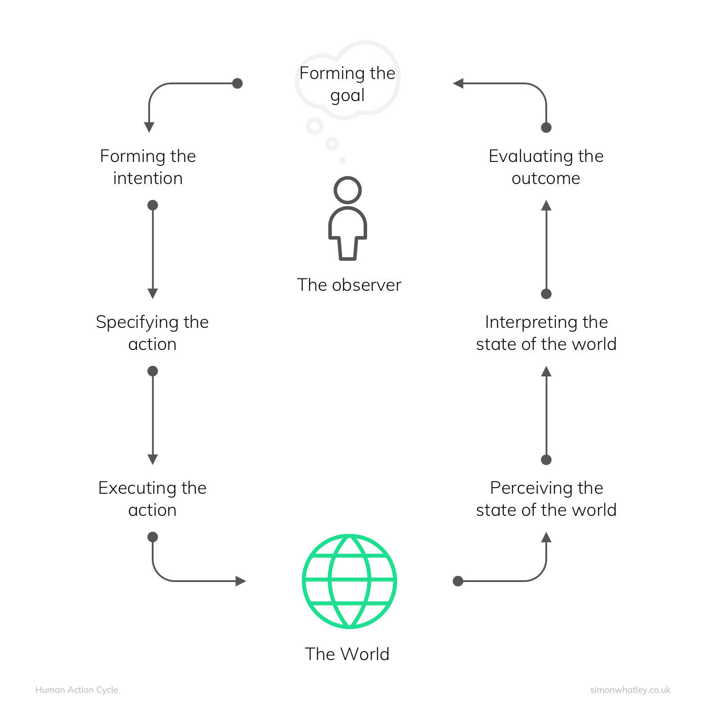

Apenas alguns exemplos, já que existem muitas teorias e modelos usados pelo design de interação. Várias das técnicas que vamos investigar aqui usam essas teorias como inspiração ou fundamento.

### Fitts' Law e Hick's Law

A **Lei de Fitts** estabelece uma relação entre a distância até um alvo e o tamanho desse alvo, influenciando o tempo necessário para alcançá-lo com precisão. Se você estiver usando um mouse ou usando o dedo em um tablet, a regra é clara, Arnaldo: _quanto mais distante o alvo estiver e menor for o seu tamanho, mais tempo levará para acertar o alvo_.

Imagine-se desenvolvendo um aplicativo de mensagens. Queremos garantir que a interação com os elementos da interface seja fácil e intuitiva, e é aí que a Lei de Fitts entra em ação. Podemos aplicar a Lei de Fitts para melhorar a usabilidade dos botões e ícones interativos no aplicativo. Por exemplo, se o botão de envio de mensagem for pequeno e estiver posicionado em um canto distante da tela, isso pode dificultar a interação. Aplicando a Lei de Fitts, podemos aumentar o tamanho do botão de envio de mensagem e posicioná-lo de forma estratégica, preferencialmente próximo à área onde o usuário está digitando a mensagem. Dessa forma, o botão se torna mais fácil de alcançar, reduzindo o esforço necessário para interagir com ele.

Outro exemplo é a utilização de links ou botões em um aplicativo de notícias. Se os links estiverem muito próximos uns dos outros e forem pequenos, pode ser difícil acertar o link desejado e o usuário pode acabar clicando no link errado. Nesse caso, aplicando a Lei de Fitts, podemos aumentar o espaço entre os links e aumentar o tamanho de cada link para facilitar o clique preciso.

Ao utilizar a Lei de Fitts, estamos tornando a interação com o aplicativo mais intuitiva e eficiente. Aumentando o tamanho dos alvos e reduzindo a distância até eles, estamos facilitando o acesso e evitando cliques acidentais. Isso contribui para uma melhor experiência do usuário e diminui a probabilidade de erros de interação.

Já a **Lei de Hick** estabelece uma relação entre o número de opções disponíveis e o tempo necessário para tomar uma decisão. Quanto mais opções tivermos, mais tempo levará para tomar uma decisão. Em um aplicativo de música, por exemplo, você pode aplicar a Lei de Hick para melhorar a usabilidade dos menus e opções de navegação no aplicativo. Se oferecermos uma lista enorme de gêneros musicais para o usuário escolher, isso pode sobrecarregar a decisão e dificultar a localização da música desejada. Aplicando a Lei de Hick, podemos simplificar as opções de navegação, agrupar os gêneros musicais em categorias principais e oferecer uma busca por palavras-chave. Dessa forma, o usuário terá menos opções para analisar e tomará decisões mais rapidamente.

Outro exemplo é a utilização de menus suspensos em um aplicativo de edição de fotos. Se oferecermos uma longa lista de filtros e efeitos especiais sem qualquer organização, o usuário terá que percorrer todas as opções para encontrar o que deseja. Nesse caso, aplicando a Lei de Hick, podemos agrupar os filtros em categorias e fornecer uma visualização prévia para ajudar o usuário a escolher rapidamente.

### Norman's Model of Interaction

Don Norman, em seu livro clássico "Design of Everyday Things", que, mesmo feito para designers em geral, teve uma influência absurda no design de interfaces computacionais, enuncia o seu **modelo de interação** (ou _sete estágios de ação_). Este propõe uma abordagem centrada no usuário, levando em consideração as três camadas principais da interação: _execução, avaliação e formação de metas_ (abaixo, figura representando o ciclo).

O modelo de interação de Norman é composto por duas partes: **o Golfo da Execução e o Golfo da Avaliação**. O Golfo da Execução se refere à distância entre as intenções e as ações do usuário, ou seja, como ele executa as tarefas no sistema. Já o Golfo da Avaliação é a distância entre as informações fornecidas pelo sistema e a compreensão do usuário, ou seja, como ele avalia o feedback recebido.

No Golfo da Execução, é importante que a interface forneça um mapeamento claro entre as ações que o usuário deseja executar e as opções disponíveis. Por exemplo, em um aplicativo de edição de fotos, se o usuário quiser aplicar um filtro, é importante que o sistema apresente claramente onde essa opção está e como ativá-la. Além disso, é fundamental fornecer feedback imediato para que o usuário perceba que a ação foi concluída com sucesso.

Já no Golfo da Avaliação, a interface deve fornecer um feedback claro e compreensível para que o usuário possa avaliar se o sistema atendeu às suas expectativas. No Ifood, é importante informar ao usuário o status do seu pedido, como o tempo estimado de entrega e as atualizações em tempo real. Isso permite que o usuário avalie se o serviço está cumprindo o que foi prometido.

Para ilustrar o modelo de Norman, podemos explorar exemplos práticos. Considere um aplicativo de streaming de música. No Golfo da Execução, o sistema deve oferecer uma interface intuitiva, com botões claros e bem posicionados para que o usuário possa facilmente reproduzir, pausar ou pular uma música. No Golfo da Avaliação, o sistema deve fornecer informações sobre a música em reprodução, como nome do artista, título da música e capa do álbum, para que o usuário possa avaliar se é a música desejada.

Outro exemplo é um aplicativo de compras online. No Golfo da Execução, o sistema deve apresentar categorias de produtos bem organizadas e filtros de pesquisa eficientes para que o usuário possa facilmente encontrar o que está procurando. No Golfo da Avaliação, é importante fornecer avaliações de outros usuários, informações detalhadas sobre o produto, como descrição e fotos, e um processo de checkout claro e seguro para que o usuário possa avaliar se o produto atende às suas expectativas.
