# 1. Introdução

O Design de Interface do Usuário (UI Design) refere-se aos elementos visuais de um produto digital. Ele foca principalmente na aparência e no estilo, e não na experiência completa (como o UX Design). Você pode pensar nele como a "superfície" de um produto digital.

Uma ótima interface de usuário deve ser utilizável (usável) e encantadora. Além de funcional, a interface deve ser agradável e prazerosa de usar. A interface mais simples possível é aquela que ajuda o usuário a resolver seu problema com esforço mínimo.

## Telas

Todo UI Design é colocado em uma tela (smartphone, laptop, tablet ou smartwatch). Cada tela tem sua própria resolução, geralmente expressa em pixels (px). Abaixo podemos ver as resoluções de tela de um iPhone e de um Macbook de 13 polegadas. Essas resoluções são as que vemos na vida real. No entanto, designers não criam UIs para essas dimensões, mas usam resoluções simplificadas, chamadas de pontos (pt), para cuja conversão vemos logo abaixo.

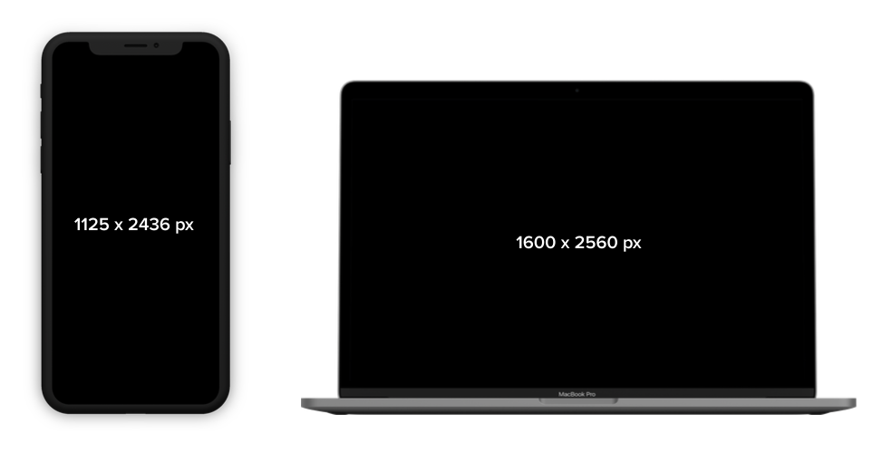
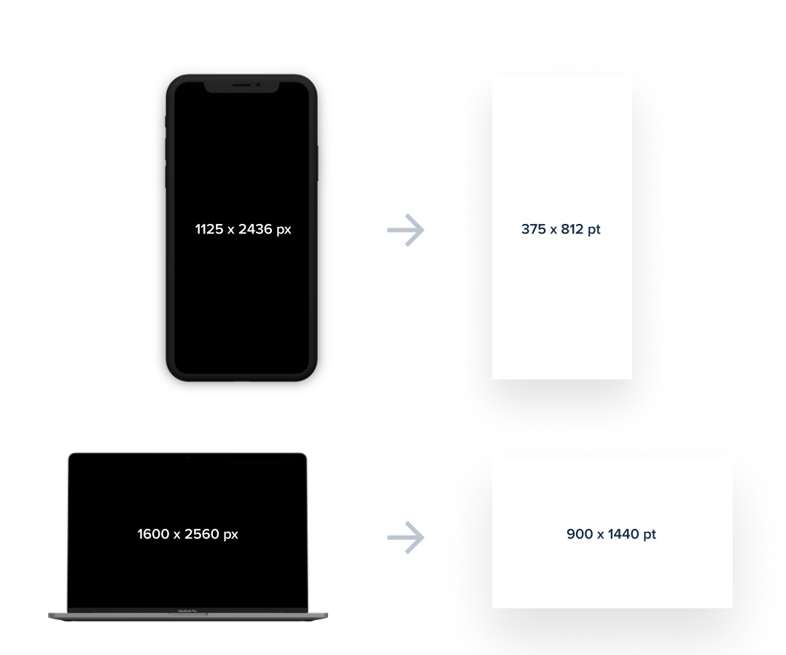

Projetar em pontos é uma simplificação estratégica. Se um designer tentasse projetar um aplicativo para um iPhone X usando sua resolução real de 1125x2436 px, o processo seria extremamente detalhado e lento. 
Ao utilizar a resolução em pontos, que para o mesmo aparelho é de 375x812 pt, o designer trabalha em uma escala reduzida que é muito mais fácil de gerenciar. A principal vantagem dessa simplificação é tornar o design mais fácil e rápido.

Trabalhar com números menores permite que o designer se concentre na proporção e na hierarquia dos elementos sem se perder na contagem de milhares de pixels individuais. As ferramentas de design modernas já trazem essas resoluções em pontos como predefinições (presets), eliminando a necessidade de memorizar cada valor. Essa abordagem garante que a proporção da tela (*aspect ratio*) seja mantida, permitindo que o design seja escalado corretamente para a resolução real do dispositivo mais tarde.

O bom é que tudo o que é criado na interface — como retângulos, ovais e textos — é um *objeto vetorial*. Isso significa que, independentemente de projetarmos em uma escala menor (pontos), o design pode ser redimensionado para a tela real de alta densidade de pixels sem qualquer perda de qualidade.

## Objetos

Enquanto a tela é nosso *canvas*, o design em si é feito de muitos elementos diferentes. Todo objeto é uma forma vetorial e pode ser redimensionado sem perder qualidade. Essencialmente, UI Design é posicionar formas (retângulos, ovais, texto) na tela.

Aqui vão algumas propriedades dos objetos que precisam ser definidas.

* Tamanho (Width e Height): Todo elemento tem largura (W) e altura (H) expressas em pontos.
* Posição (X e Y): O valor X indica a distância da borda esquerda e o valor Y a distância da borda superior.
* Rotação: Os valores variam de 0 a 360 graus.
* Preenchimento (Fill): Pode ser cor, gradiente ou imagem
* Borda (Border/Stroke): Existem três tipos: interna (most frequent), centralizada e externa.
* Raio da Borda (Border Radius): Define o quão arredondados são os cantos. Usar 0 pt é raro; cantos arredondados dão uma sensação mais amigável.
* Sombras (Shadows): Funcionam como uma camada separada e possuem valores de X, Y, Blur e Opacidade.
* Desfoque (Blur): Pode ser Layer Blur (desfoca o próprio elemento) ou Background Blur (desfoca o que está por baixo do elemento).

# 2. Antes de Começar: padrões de UI

Os padrões de UI são as formas mais comuns como pensar e se comportar ao se relacionar com interfaces de software. Mesmo que cada indivíduo seja único, pessoas em geral se comportam de forma previsível, por isso padrões podem ser observados e reutilizados. Designers estudam visitas em sites e usuários por anos; cientistas cognitivos e outros pesquisadores passam muito tempo tentando entender as pessoas. Os princípios e os padrões são resultado de todo esse conhecimento. Muitos padrões de UI podem ser encontrados em catálogos ou sites ([http://ui-patterns.com](http://ui-patterns.com)). Usaremos aqui como referência o seguinte livro texto:

**Designing Interfaces: Patterns for Effective Interaction Design**.
Jenifer Tidwell et al. Terceira Edição.
O'Reilly.
Link: [https://www.oreilly.com/library/view/designing-interfaces-3rd/9781492051954/]

# 3. Navegação

Padrões de navegação lidam com o desafio de deixar claro a usuários em que local do sistema eles se encontram, mostrando como sair de um local e chegar em outro. Parece fácil, não é? Na verdade, é uma tarefa gigantesca para designers. O melhor sistema de navegação é aquele que não é percebido. Deixar o que é importante sempre à mão, tirando do foco aquilo que é menos importante, mantendo uma distância curta para chegar a qualquer lugar.

A navegação pode ser categorizada em três tipos principais, dependendo de como os links são apresentados ao usuário. A navegação *visível* é aquela em que as opções de menu estão sempre expostas, geralmente em uma barra superior ou lateral, facilitando o acesso imediato às seções principais do produto. Já a navegação *oculta* (como o famoso menu "hambúrguer") esconde as opções atrás de um ícone para economizar espaço em tela, sendo uma escolha comum em dispositivos móveis para reduzir a carga cognitiva, embora exija um clique extra do usuário para que as opções apareçam.

A navegação *contextual*, por sua vez, não se limita a menus estáticos, mas surge diretamente do conteúdo com o qual o usuário está interagindo no momento. Ela utiliza links internos, hashtags, botões em cards ou sugestões de "leia também" para guiar o usuário de forma fluida pelo fluxo da aplicação, baseando-se no que ele está visualizando. Integrar esses três tipos de forma equilibrada garante que o design seja "invisível" e eficiente, permitindo que o usuário complete suas tarefas com o mínimo de esforço possível.
A navegação visível seria a melhor escolha sempre, se tivéssemos espaço infinito na tela. Em geral quando há no máximo cinco opções este tipo de navegação se torna possível.

Alguns conceitos são úteis, principalmente para opções de navegação visível. _Signposts_ são elementos que ajudam os usuários a ter noção de seu ambiente. Coisas como título de página e janela, logos, abas, e indicações de seleção, além de indicadores de progresso, _breadcrumbs_, e barras de rolagem. Designers UI usam também o termo _Wayfinding_ para indicar a ação da usuária em encontrar algo; para facilitar tal processo, esperamos do sistema algumas qualidades:

* Boa sinalização;
* Indicações claras, padronizadas;
* Mapas.

Os padrões de navegação tentam promover certas boas práticas gerais. Vamos a elas:

* Separar o projeto de navegação do projeto visual: priorize a forma da usuária navegar, depois disso pense na estética, respeitando as decisões iniciais;
* Carga Cognitiva: Novas páginas adicionam carga cognitiva, a tal "mudança de contexto". As decisões que a usuária deve tomar em cada uma precisam ser padronizadas.

Os padrões de **navegação** versam sobre vários aspectos de navegação: estrutura geral, determinação do status, determinação de onde ir, e formas de chegar lá eficientemente. No livro texto de padrões, páginas 129 a 208.

- Clear Entry Points
- Menu Page
- Pyramid
- Modal Panel
- Deep Links
- Escape Hatch
- Fat Menus
- Sitemap Footer
- Sign-In Tools
- Progress Indicator
- Breadcrumbs
- Annotated Scroll Bar

# 4. Layout e Grids

O layout determina o jeito como os elementos (componentes) estão dispostos. Cada elemento pode ser _informacional, funcional, de enquadramento ou decorativo_. A disposição desses elementos ajuda a guiar e informar usuários sobre a importância relativa de informação e funções. Normalmente ouvimos falar do termo interface _limpa_. Um layout limpo segue princípios de hierarquia da informação visual, fluxo visual, alinhamento, além de seguir princípios _Gestalt_.

O conteúdo mais importante deve se destacar mais, e o menos importante deve ficar menos proeminente. Uma boa hierarquia visual nos fornece, instantaneamente:

- a importância relativa dos elementos de tela;
- os relacionamentos entre eles;
- o que fazer em seguida.

Na figura abaixo, é possível perceber qual informação é mais importante, nas duas telas? A maioria das pessoas acha o exemplo B mais fácil de entender, já que os elementos, o tamanho relativo e a proporção entre eles implica sua importância e guia o leitor ao que realmente importa. Em B, podemos dizer que há uma _hierarquia visual_ ausente em A.

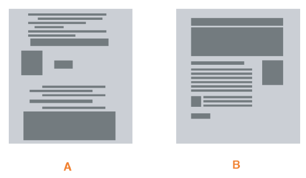

O que faz os elementos tornarem-se importantes?

- Tamanho
- Posição
- Densidade: quanto mais denso, melhor para ler, em geral
- Cores de fundo
- Ritmo: espaços entre elementos, grades de elementos
- Alinhamento

## Princípios Gestalt

_Gestalt_ é o alemão para "forma", conceito esse da teoria psicológica dos anos 1920s; traz regras que descrevem como humanos percebem objetos visuais. Isso tudo ajuda a definir propriedades de layout que acabam sendo naturais em sistemas visuais.

**Proximidade.** Quando objetos são colocados juntos, quem os visualiza associa um com outro. Por isso elementos relacionados devem ser agrupados visualmente.

**Similaridade.** Itens similares em tamanho, formato ou cor são percebidos com relacionados.

**Continuidade.** Nossos olhos naturalmente seguem as linhas percebidos e as curvas formadas pelo alinhamento de outros elementos.

**Fechamento (Closure).** Nosso cérebro naturalmente "fecha" linhas para criar formas simples fechadas, mesmo se essas linhas não forem explicitamente fechadas. Exemplos abaixo:

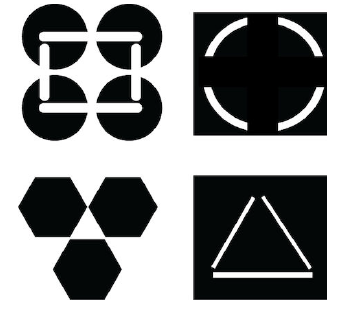

Esses princípios são normalmente usados em combinação. Continuidade e fechamento juntos justificam o alinhamento de elementos, por exemplo.

Os padrões de design para layout definem modos específicos para dispor os componentes na interface. Eles articulam a hierarquia visual de páginas ou telas inteiras (Páginas 209 a 254).

- Visual Framework
- Center Stage
- Grid of Equals
- Module Tabs
- Accordion
- Collapsible Panels
- Movable Panels

## Grids

Um *grid* (grade) é um conjunto de linhas horizontais e verticais, que dividem a tela em colunas e linhas. São importantes porque fornecem estrutura a uma página ou aplicação, assegurando espaçamento consistente entre os elementos. 

Colunas são as seções verticais do grid; quanto mais colunas, mais flexível é o grid. A maoria dos designs utilizam 12 colunas.

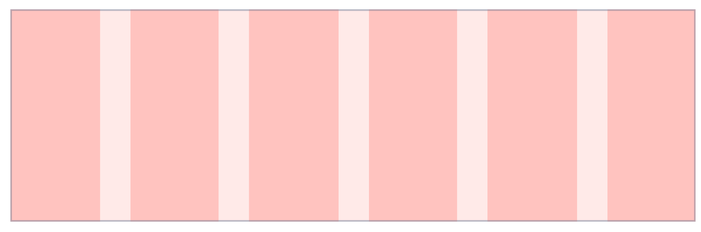

Já as linhas são as seções horizontais, mas são usadas raramente em design para a web, por exemplo. Os grids são mais baseados nas colunas mesmo, em geral. Mais importantes são os *gutters* (calhas) são os espaços vazios que dividem as colunas e as linhas dentro de um grid de design. Determinam a densidade do conteúdo: quanto menor a largura da calha, mais apertado e denso o conteúdo parecerá na tela. Em interfaces web, é comum utilizar valores como 12pt, 14pt, 16pt ou 20pt para as calhas, garantindo que haja um respiro adequado entre os elementos.

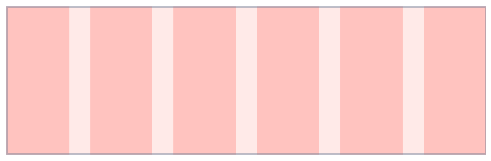
*Gutters*

Outros conceitos importantes são *margem* e *módulos*. Estes são os pontos de encontro entre colunas e linhas.

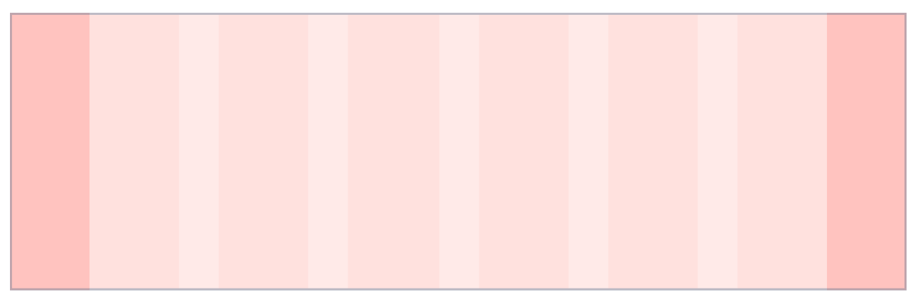
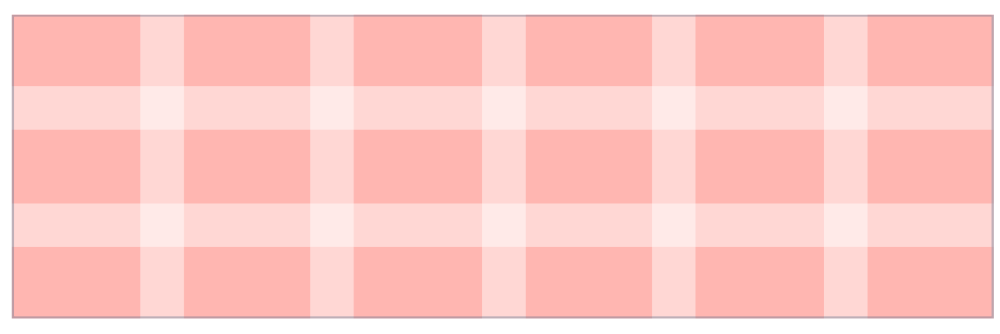

Não existem muitos tipos de grid em Design UI, mas também não há um formato universal. Podemos ver abaixo os tipos mais usados.

O *tipo fluido* apresenta colunas que mudam a largura baseado na largura da tela, enquanto a margem e a calha permanecem fixas. Este é o tipo de grid perfeito para o design de interfaces *responsivas*, em que o tamanho do conteúdo muda com o tamanho da tela.

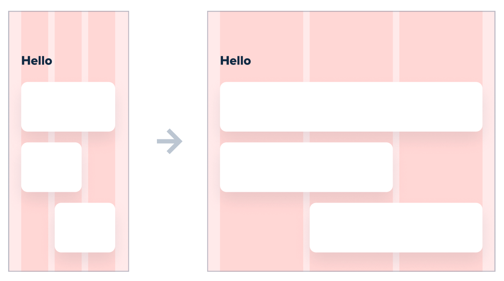

Por outro lado, o *grid fixo* tem um imutável para colunas e calhas, com a variação das margens apenas. Funciona bem para telas em que os componentes devem manter seu tamanho, independente do que acontecer.

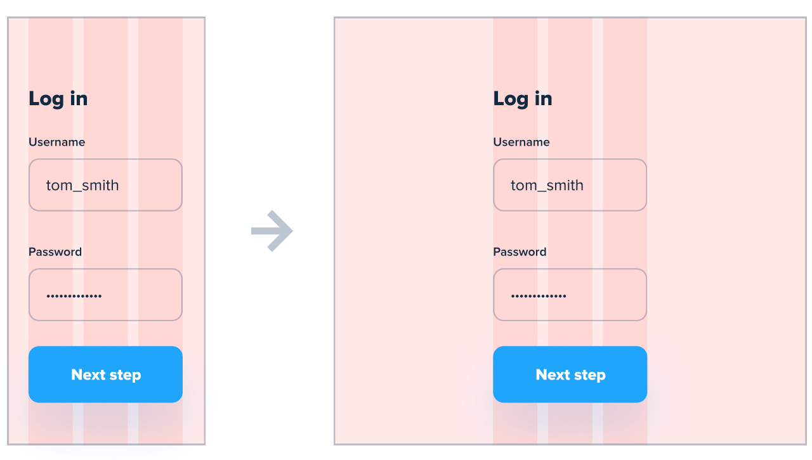

As ferramentas já fazem este cálculo para nós -- como é o caso do Figma -- mas vale a pena discutir o cálculo de tamanho de colunas e calhas. No design para web, é comum utilizar calhas com valores entre 12pt e 20pt para manter uma estrutura consistente. Por exemplo, ao configurar um grid de 12 colunas em uma tela de 1440pt de largura, você pode definir margens de 160pt e calhas de 20pt; nesse cenário, o espaço total das calhas (11 calhas de 20pt cada) será subtraído da largura total para ajudar a determinar o tamanho exato de cada coluna. O cálculo matemático seria: primeiro, subtraia as duas margens (1440 - 320 = 1120) e, em seguida, as 11 calhas (1120 - 220 = 900); ao dividir o restante pelas 12 colunas (900/12), você descobre que cada coluna deve ter exatamente 75pt de largura.

Uma técnica bastante usada é a do *grid de 8 pontos*.
A ideia baseia-se no princípio de utilizar múltiplos de 8 (como 8, 16, 24, 32, etc.) para definir as dimensões de elementos, margens, preenchimentos (paddings) e o espaçamento entre componentes em uma interface. 
A escolha do número 8 justifica-se pelo fato de que a grande maioria das resoluções de tela atuais é divisível por 8, o que garante que o design seja escalado de forma consistente e evite o aparecimento de meios pixels, resultando em uma interface mais nítida e organizada em diferentes dispositivos.

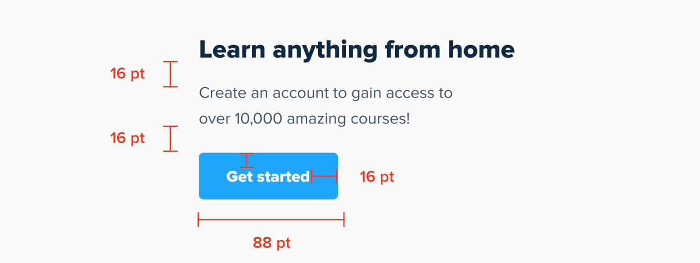

Ao implementar este sistema, a designer pode optar por dois caminhos: o *Hard Grid* ou o *Soft Grid*. No Hard Grid, todos os elementos devem seguir estritamente os incrementos de 8pt e "encaixar" em um padrão de grade visível, o que pode ser bastante rígido. Já o Soft Grid, que é a abordagem preferida por muitos profissionais, foca apenas em medir o espaçamento entre os elementos utilizando a escala de 8pt, oferecendo maior flexibilidade sem sacrificar a consistência visual e a harmonia do layout.

Pensando em texto agora. É bom tentar alinhar na linha de base (*baseline*) sobre a primeira linha de texto. Assim, independente do tamanho da fonte, o texto estará bem alinhado.

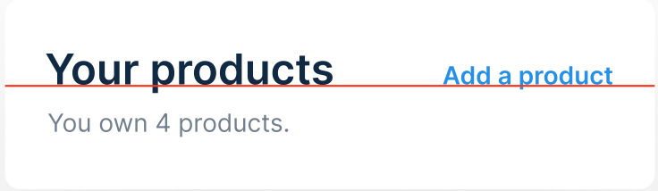

# 5. Estilo Visual e Estética

Design visual (_look-and-feel_) pode fazer um produto digital se destacar. A linguagem visual usada simboliza uma mensagem que acaba sendo importante para a usabilidade do produto. _Looking good matters_.
A mais pura beleza digital é a combinação da forma física com a função desejada, funcionando juntos, em harmonia. No design de software, não é suficiente que cada pixel seja perfeito, pois deve combinar com utilidade, compreensão e prazer de uso.

O que faz um bom design visual? Em geral é um conjunto de propriedades: composição, cores, tipografia, legibilidade, evocação de sensações, e imagens.
Por exemplo, a figura abaixo traz telas que evocam sensações diferentes, ainda que contenham os mesmos elementos visuais.

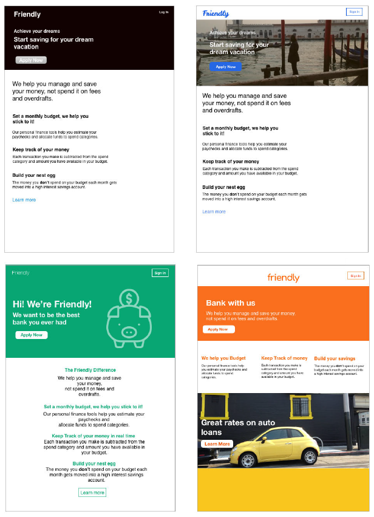

Há uma quantidade enorme de padrões relacionados a cada propriedade de design visual. Só para cores, já existe um corpo razoável de conhecimento que pode ser aplicado ao design.

Para criar designs visualmente atraentes, é importante compreender os princípios de _teoria das cores, tipografia, layout e hierarquia visual_. 

## Cores

A teoria das cores nos ajuda a escolher combinações de cores que transmitam a mensagem certa e evocam as emoções desejadas. Por exemplo, para um aplicativo de saúde e bem-estar, cores calmas e naturais podem ser mais adequadas do que cores vibrantes e intensas.

Por exemplo, sugere-se sempre colocar cores frontais escuras sobre cores de fundo claras, e vice-versa (designers testam isso visualizando como escala de cinza em ferramentas como Photoshop). Ou ainda, quando verde ou vermelho indicam alguma distinção, é bom reforçar essa distinção com alguma forma diferente ou texto - cerca de 10% dos homens e 1% das mulheres apresentam alguma forma de daltonismo.

Adicionalmente, é bom evitar algumas combinações de cor. Por exemplo, texto azul brilhante num fundo vermelho cansa os olhos, pois são cores _complementares_, estando localizadas em lados opostos na chamada roda das cores (abaixo).

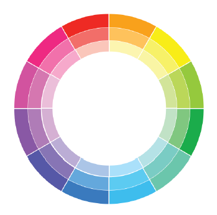

Quando estamos falando de computadores, tablets ou smartphones, o fundo escuro tem sido uma opção disseminada, para poupar visão e até energia. Outras questões relacionadas a cores: cores quentes ou frias, contraste baixo (mais relaxante) ou alto (maior tensão/força), muito ou pouco saturado.

## Hieraquia

Além disso, a disposição dos elementos na interface é fundamental para criar uma experiência coerente. A hierarquia visual nos ajuda a guiar os olhos do usuário, destacando informações importantes e organizando o conteúdo de forma lógica. Por exemplo, um aplicativo de notícias pode usar tamanhos maiores de fonte e cores vivas para manchetes, enquanto o texto do corpo utiliza uma fonte mais simples.

## Fontes

A tipografia também é crucial: escolher fontes legíveis e que se alinhem à identidade do aplicativo é essencial para uma boa legibilidade. 
A tipografia é definida como a arte e a técnica de organizar tipos para tornar a linguagem escrita legível, compreensível e visualmente atraente quando exibida em uma interface. Envolve a seleção cuidadosa de fontes e famílias tipográficas que comuniquem a mensagem de forma eficaz, respeitando regras de anatomia do tipo, espaçamento e hierarquia para garantir que o conteúdo seja o foco principal sem causar distrações.

*Typeface* (Família Tipográfica) é o design visual das letras, números e símbolos que compartilham um estilo comum. É o conceito criativo e artístico; por exemplo, Inter, Roboto ou Helvetica são typefaces. Já a fonte é a variação específica de peso, largura ou estilo dentro dessa família. É o arquivo ou o formato que você utiliza para aplicar o design. Por exemplo, Inter Bold Italic tamanho 16pt é uma fonte. Seguindo a analogia, a fonte é um "membro" específico da família.

A figura abaixo traz (em inglês) os conceitos básicos relacionados ao trabalho com texto. A não em casos muito específicos, designers não vão criar novas famílias tipográficas para um projeto -- esses conceitos são mais importantes para entender as escolhas de fontes que devem ser feitas.

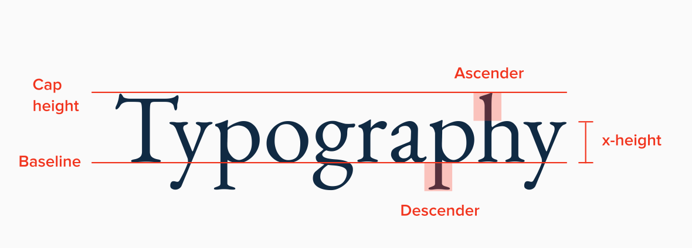

A *baseline* (linha de base) é a linha invisível onde a maioria das letras se apoia ; a *cap height* (altura da caixa alta) mede a altura das letras maiúsculas a partir da linha de base; a *x-height* (altura de x) refere-se à altura das letras minúsculas (excluindo hastes), já o *ascender* (ascendente) é a parte da letra minúscula que sobe acima da altura de x (como no "h" ou "d").O *descender* (descendente) é a parte que desce abaixo da linha de base (como no "p" ou "g").

O *line height* (altura da linha) é o espaço vertical entre as linhas de texto, medido de uma linha de base (baseline) até a próxima. Para garantir uma boa legibilidade, sugere-se que a altura da linha deve ser maior que a altura dos caracteres (*cap height* mais  ascendentes), permitindo que o olhar do usuário deslize facilmente entre as frases sem se perder. Uma regra prática comum é definir o line height entre 140% e 160% do tamanho da fonte. Por exemplo, se você estiver usando uma fonte de 16pt, uma altura de linha de 24pt (150%) costuma criar um equilíbrio ideal, evitando que as ascendentes de uma linha encostem nas descendentes da linha superior e garantindo que o bloco de texto não pareça muito denso ou muito disperso.

Para a escolha de famílias tipográficas, existem duas categorias bem comuns: serifa ou sem serifa. Esta última é normalmente o padrão, e mais comum. As famílias serifa acabam não sendo a escolha principal, a não ser que se adequem à marca do produto. Famílias *script*, *caligraphy* ou *handwritten* são difíceis de ler e nunca são usadas como escolha principal.

Há poucas dicas no sentido de escolher a família tipográfica. Duas dicas: usar famílias escaláveis, que são bem lidas em tamanhos variados, ou mesmo extremos. Aqui, a criatividade e a experiência dos designers, a partir de pesquisa, são imprescindíveis. Adicionalmente, os designer utilizam apenas uma família tipográfica em um projeto, variando na ênfase e no tamanho, apenas.

Uma técnica usada para a escolha de tamanhos de fonte, a partir do tamanho base, é a aplicação da chamada proporção dourada (*golden ratio*): 1,618. Ela age como multiplicador para criar uma escala tipográfica harmônica. O processo começa com a definição de um tamanho base para o texto do corpo (como 16pt) e, a partir dele, multiplica-se ou divide-se esse valor por 1,618 para encontrar os tamanhos dos títulos e subtítulos. Embora essa técnica gere proporções matematicamente equilibradas, ela pode ser problemática, pois frequentemente cria lacunas muito grandes entre os tamanhos (pulando, por exemplo, de 16pt diretamente para 26pt), o que pode exigir ajustes manuais para incluir tamanhos intermediários necessários à interface.

Existe a chamada escala manual, que começa com a escolha de um tamanho base e avança através de incrementos fixos: utiliza-se a soma ou subtração de 2pt para tamanhos próximos ao corpo do texto (criando variações como 10, 12, 14, 16, 18 e 20pt) e, para tamanhos maiores destinados a cabeçalhos onde o detalhe fino é menos necessário, utiliza-se incrementos de 4pt ou até 8pt. 

Podemos listar algumas dicas relacionadas à escolha das variações de fonte para estabelecer hierarquia visual:

* Ao combinar um título com um texto de corpo, a recomendação é pular um ou dois pesos para garantir contraste suficiente. Por exemplo, se o texto do corpo for Regular, use Bold para o título, evitando combinações muito próximas como Regular e Medium, que podem parecer inconsistentes.

* Geralmente, tamanhos de fonte maiores suportam pesos mais altos (como Bold), enquanto tamanhos menores funcionam melhor com pesos menores. Um exemplo de escala seria usar 12pt com peso Regular e 20pt com peso Bold.

* Deve-se evitar o uso de pesos muito leves (Light) para textos pequenos, pois isso prejudica significativamente a leitura. Para esses casos, o peso Regular é o mínimo recomendado.

* É possível aumentar o espaçamento entre letras (letter spacing) em textos todo em maiúsculas para melhorar a legibilidade, especialmente quando se usa pesos mais pesados.

Os *rags* referem-se às bordas irregulares formadas quando as linhas de um bloco de texto terminam em pontos diferentes devido ao comprimento variável das palavras. O salto visual excessivo entre uma linha longa e uma muito curta exige mais esforço dos olhos do usuário, prejudicando o ritmo da leitura. 

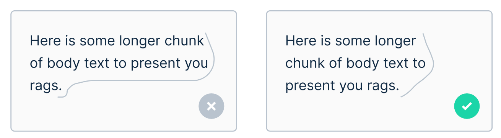

Algumas dicas para lidar com esse problema incluem:

* Priorize o alinhamento à esquerda: É a escolha mais segura para a leitura ocidental, pois mantém o ponto de partida de cada linha consistente.

* Evite textos centralizados para blocos longos: O alinhamento centralizado cria "rags" em ambos os lados, tornando a leitura cansativa em textos extensos.

* Controle o comprimento da linha: Uma linha ideal deve ter entre 50 a 60 caracteres; linhas muito longas ou curtas demais acentuam os problemas de *rags* e dificultam a legibilidade.

* Ajuste manual quando possível: Em elementos fixos como banners, você pode ajustar o texto para suavizar a transição entre as linhas, embora em plataformas dinâmicas isso nem sempre seja possível.

Os sistemas de design escolhidos para o projeto normalmente possuem padrões a serem utilizados.

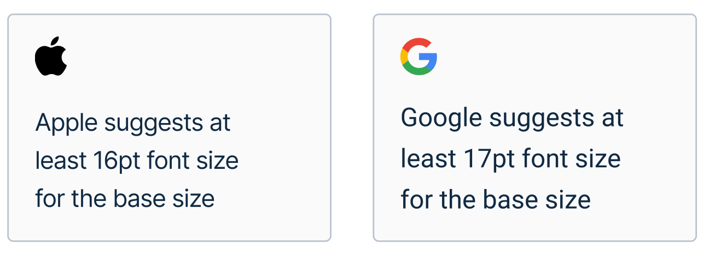

## Ícones

Os ícones são bem vistos por uma simples razão: com eles, usuários têm menos a ler. Eles são imagens usadas para comunicar algo, com um valor simbólico significativo, oferecendo informação visual simples de ler e entender. Muitos ícones substituem o texto na maioria das vezes. Na figura abaixo, podemos imaginar os ícones sozinhos, sem o texto que vem abaixo. O objetivo é sempre facilitar o entendimento, não usá-los pela estética.

No design, existem dois tipos de ícones. Os ícones *esclarecedores* servem para explicar algo, como uma funcionalidade. Um exemplo está nas categorias de produtos de um comércio eletrônico. Esses normalmente não são ícones com os quais interagimos, eles apenas esclarecem a informação.

Por outros lado, os ícones interativos são aqueles normalmente usados para navegação. Usuários interagem com eles para realizar ações claramente simbolizadas pelos ícones. Estes ícones funcionam melhor se foram simples e bem conhecidos. 

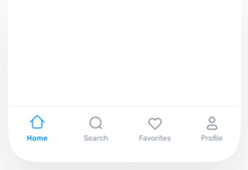

Todo mundo tem medo de clicar em um ícone para fazer algo, sem saber exatamente o que o ícone faz. Esse era o caso do sistema de processos do governo federal do Brasil, em uma de suas versões passadas, como mostrado na figura abaixo, em que há uma comparação com a versão mais recente dos ícones. Os ícones devem apresentar uma área razoável para clique ou toque (44x44pt em geral), pois, mesmo pequenos, os usuários interagem muito com eles.

Para uma aplicação, é raro que designers criem novos ícones únicos. Em geral, a escolha de ícones é feita a partir de um *pacote completo de ícones*, pois garante-se que os ícones são consistentes, no mesmo estilo. Designers não escolhem ícones de grupos diferentes. Os ícones abaixo, por exemplo, pertencem ao chamado pacote [*Anron Icons*](https://www.anron.pro/). Existem várias bibliotecas de ícones prontas, até mesmo de uso livre.

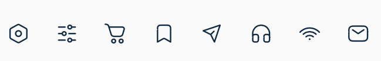

Alguns padrões no uso de ícones:

* usar ícones simples e bem conhecidos: *home, search, favorites, settings*. São comumente usados pela maioria; ao complicá-los, o design fica pior.
* usar ícones escaláveis, que aparecem corretamente, sem problemas, com tamanhos diferentes de zoom. Se o desenho do ícone for complexo, suas imperfeições vão aparecer quando aumentados.
* usar ícones com largura de linha consistentes. É estranho um ícone com linhas grossas usado em conjunto com ícones de desenho de linha bem fino. Pede-se a mesma consistência para curvatura das linhas, evitando ícones geométricos com outros mais curvados.
* Eliminar completamente o texto que acompanha o ícone só quando há total certeza de que não haverá confusão. Às vezes, é melhor manter o texto, principalmente quando o ícone não é tão conhecido. 
* Os ícones em conjunto devem estar dentro de uma caixa limite do mesmo tamanho para todos, para manter a consistência do seu layout, como mostra a figura abaixo.

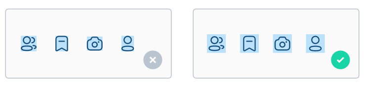

# 6. Entrada de Dados

Os formulários no UI Design são ferramentas para a coleta de informações, permitindo que os usuários insiram dados e interajam com o sistema para completar tarefas específicas. Já tem uns 30 anos que usamos formulários para entrada de dados em sistemas de informação, e isso é um bom motivo para acharmos que não há muito o que fazer nessa seara, em termos de design. Somos meio que direcionados pelos frameworks de _front-end_ a usar seus elementos "de prateleira".

Mas existem muitos problemas a lidar. Muitas vezes os formulários são baseados em grids fluidos em telas grandes, o que estica excessivamente os campos de entrada, tornando-os muito largos e prejudicando severamente a legibilidade e o foco do usuário. Pode faltar também hierarquias claras entre rótulos e campos, ou o uso de tamanhos de fonte inadequados, causando frustração e dificultando o preenchimento correto das informações.

O objetivo chave de qualquer design: usuários precisam completar o preenchimento do formulário, completando sua tarefa desejada como esperado. Em sistemas web, frequentemente se usa a medida *taxa de conversão*: a percentagem de pessoas que submetem as informações de um formulário com sucesso. 

Construímos os formulários com componentes: etiquetas, campos de texto, listas, botões de opção ou checagem, *sliders* ou botões, cada um servindo para um propósito diferente, dedicados a diferentes tipos de dados. Usar o elemento apropriado para cada tipo de dado é fundamental para aumentar a taxa de conversão.

Os diferentes tipos de *campos de texto* são projetados para otimizar a entrada de dados específica e garantir a usabilidade em diferentes contextos. 
É fundamental que campos como e-mail, números ou senhas (password) utilizem um tamanho de fonte base de pelo menos 16pt ou 17pt para garantir que o texto seja legível e para evitar que o navegador dê zoom automático no campo durante o preenchimento. 
Campos de senha possuem a característica funcional de ocultar os caracteres, enquanto campos de números ou e-mail em dispositivos móveis acionam teclados virtuais específicos, melhorando a experiência do usuário. 
Visualmente, a variação entre campos pequenos ou grandes é controlada através de escalas de espaçamento (como o grid de 8pt ou 4pt), onde o preenchimento interno (padding) e a altura do campo são ajustados em múltiplos desses valores para manter a consistência e a hierarquia visual em relação aos outros elementos da interface.

Em geral, os campos de texto devem ter largura apropriada ao tipo de dados, mesmo que o preenchimento não seja afetado. Campos menos largos para dados mais curtos são mais intuitivos, como na figura abaixo.

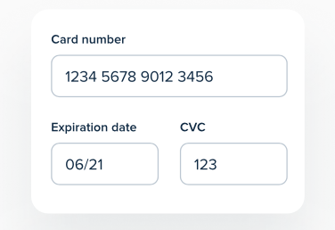

Outro padrão ao projetar os campos é utilizar *placeholders*, como no caso abaixo, em *Username*. Este elemento pode se manter como um rótulo no momento de digitação, estressando, com foco, o local.

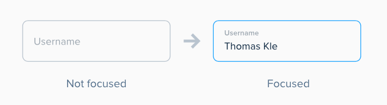

O design de *dropdowns* traz questões interessantes de design para ser discutidas. Eles são similares aos campos de texto, mas a indicação à direita os diferencia. No clique ou interação, há a expansão dos elementos - por exemplo, para indicar um país ou estado. Usá-los para até 4 opções é ruim, melhor usar botões de opção (*radio buttons*). Um padrão, no caso de muitos elementos, é colocar um dropdown dentro de uma barra de busca, onde, a partir da digitação de caracteres, são filtradas as opções de interesse. Existem também a possibilidade de adicionar barras de rolagem na lista, para evitar que as opções quebrem o layout.

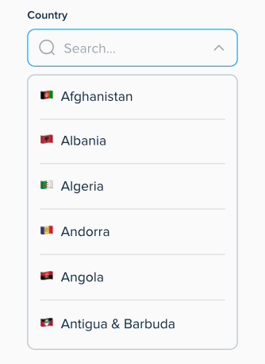

Os *radio buttons* são utilizados quando o usuário deve escolher apenas uma única opção dentro de um conjunto de alternativas mutuamente exclusivas. Já os *checkboxes* permitem que o usuário selecione uma ou múltiplas opções de uma lista, ou até mesmo nenhuma. Por fim, os *switches* (ou interruptores) são componentes de ação imediata, idealmente utilizados para alternar entre dois estados opostos, como ligar ou desligar uma funcionalidade específica. Os *switches* são melhores para opções de elementos não-relacionados, por exemplo em configurações. O layout desses botões de opção deve cuidar de que os elementos não fiquem muito pequenos, usando as ideias da Lei de Fitt. As etiquetas correspondentes devem ter tamanho consistente.

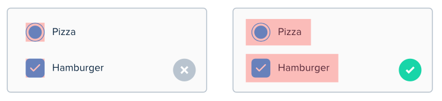

Alguns princípios no design de formulários (mais detalhes nas páginas 471 a 532 do livro):

* Fazer formulários simples e curtos, percebendo o tempo que será gasto neles;
* Minimizar quantidade de elementos de entrada: por exemplo, precisa mesmo selecionar a bandeira, já que os dois primeiros inteiros identifica a operadora do cartão;
* Minimizar elementos visuais não-essenciais;
* Agrupar e colocar título em seções de elementos de formulário quando for possível e apropriado;
* Usar alinhamento para o fluxo vertical da visão;
* Indicar claramente obrigatórios e opcionais
* Aceitar variações no formato, como no caso de datas e endereços.
* Realizar prevenção de erros e validação o mais rápido possível na interação - feedback em tempo de digitação, se possível.

# 7. Ações e Comandos 

Aqui examinamos as maneiras pelas quais as pessoas realizam o trabalho no software. Este capítulo explora diferentes métodos para iniciar ações ou ativar comandos, além de como deixar claro que um item pode sofrer uma ação por meio de *affordances*. Falaremos também de padrões e componentes que promovem o controle e a edição.
Isso contrasta com nossas discussões sobre "substantivos" no design de interface até agora. Primeiro, discutimos estrutura, fluxo e layout visual. Revisamos até agora objetos de interface, como janelas, textos, links e elementos estáticos em páginas. 

Pensamos nos verbos (projetando ações e comandos) como os métodos que as pessoas podem usar para realizar tarefas em sua aplicação. Especificamente, o que queremos dizer com isso é como a pessoa que usa seu software pode realizar estas tarefas:

* Iniciar, pausar, cancelar ou completar uma ação.
* Inserir uma configuração ou valor.
* Manipular um objeto ou componente na interface.
* Aplicar uma alteração ou transformação.
* Remover ou excluir algo.
* Adicionar ou criar algo.

Muitos dos padrões descritos aqui vêm de interfaces de hardware que foram desenvolvidas e padronizadas muito antes de as interfaces de software se tornarem onipresentes. 
Outros padrões imitam comportamentos e métodos do mundo real diretamente. 
É verdade que há muita história aqui e muitas melhores práticas a seguir. 
Os guias de estilo de plataforma padrão, como os de Android e iOS, Windows e Macintosh, e frameworks JavaScript para interfaces de usuário (UIs) web e móveis responsivas, geralmente o deixarão bem próximo de uma UI funcional.
Uma boa estratégia de UI é perceber que a "falta de originalidade" nos ambientes de software atuais apenas significa que existem agora padrões de UI quase universais para muitos processos comuns que seu público já aprendeu. Eles estão prontos para usar essas habilidades imediatamente.

Na UI padrão, os *botões* são colocados diretamente na interface. São óbvios e fáceis de usar, mas ocupam bastante espaço. Em páginas de destino (*landing pages*), chamadas para ação (*calls to action*) são geralmente representadas por botões grandes e chamativos. As *barras de menu* são padrão em aplicações de desktop. Organizam o conjunto completo de ações de forma previsível (Arquivo, Editar, Visualizar). Similarmente, menus de contexto (*Pop-up*) são ativados com o clique do botão direito do mouse -- devem ser curtos e específicos para o contexto do objeto clicado. As *barras de ferramenta* normalmente são feitas de ícones, funcionando melhor quando as ações têm representações visuais óbvias.

No design de dispositivos móveis, os gestos com os dedos são o método principal para realizar ações. Neste caso, tocar (Tap) equivale ao clique do mouse. Deslizar (Swipe) é usado para navegação, rolagem ou para revelar ações ocultas (como excluir um item de uma lista). Já pinçar (Pinch) controla o zoom, aproximando ou afastando a visualização. Também em dispositivos móveis, é possível a manipulação física. Rotacionar o dispositivo muda a orientação de retrato para paisagem. Chacoalhar pode ser usado para comandos como "desfazer" ou "pular música".

O conceito de *affordance* também pode ser exercitado em produtos digitais. Quando um objeto de interface parece que permite fazer algo (clicar, arrastar), dizemos que ele possui uma affordance.
Exemplos de affordances:

* Botões com bordas elevadas ou sombras.
* Texto com cor diferente ou sublinhado (links).
* Objetos que mudam de cor ao passar o mouse.
* Ícones que se destacam do restante do layout.

Abaixo, um exemplo de affordances do aplicativo Adobe Premier Rush.

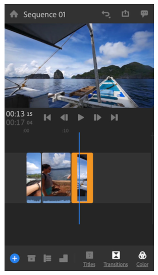

Abaixo, listamos alguns padrões de UI ligados a ações e comandos (Cap. 8 do livro texto de Padrões).

### Grupo de Botões

Um grupo de botões é uma técnica de design que reúne ações relacionadas em um cluster visual único, geralmente alinhado horizontal ou verticalmente. Essa abordagem ajuda a tornar a interface autodescritiva, pois utiliza a proximidade e a similaridade visual para indicar que os comandos pertencem ao mesmo contexto ou operam sob semânticas parecidas. Ao organizar os botões dessa forma, o designer reduz o caos visual e facilita a varredura da página, permitindo que o usuário identifique rapidamente as opções disponíveis sem se sentir sobrecarregado por elementos dispersos em diferentes áreas da tela.

A implementação eficaz desse padrão exige que todos os botões no grupo compartilhem o mesmo tratamento gráfico, como cores, bordas e estilos de ícones, para reforçar o princípio de fechamento da *Gestalt*. No entanto, é comum dar um destaque especial ao botão de ação primária dentro do grupo, como um botão "Salvar" em contraste com um "Cancelar", orientando o foco do usuário para o objetivo principal. Esse padrão é amplamente utilizado em barras de ferramentas e editores de texto, onde ações como negrito, itálico e sublinhado são agrupadas para facilitar o acesso rápido e a compreensão imediata da função de cada ferramenta.

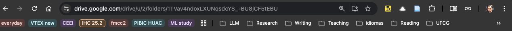

### Ferramentas de Passagem de Mouse ou Pop-Up (Hover or Pop-Up Tools)

Este padrão consiste em ocultar botões de ação e ferramentas de edição até que o usuário posicione o cursor do mouse sobre um item específico ou, no caso de dispositivos móveis, toque nele. Essa técnica é ideal para interfaces que exibem listas densas de objetos, como feeds de e-mail ou galerias de fotos, onde mostrar todos os comandos para cada item simultaneamente resultaria em uma interface extremamente poluída e confusa. Ao manter as ferramentas ocultas por padrão, o design prioriza o conteúdo principal, revelando as funcionalidades apenas no momento e local exatos em que são necessárias para a interação.

Para garantir uma boa usabilidade, a resposta ao movimento do mouse deve ser instantânea, evitando transições lentas que possam frustrar o usuário durante tarefas rápidas. É crucial que a área de interação seja claramente definida e que a aparição das ferramentas não cause um rearranjo abrupto do layout da página, mantendo a estabilidade visual da composição. Embora excelente para interfaces desktop orientadas ao mouse, este padrão exige adaptações para telas sensíveis ao toque, onde a falta de um estado de "hover" geralmente leva à substituição das ferramentas por menus de contexto ou painéis sobrepostos após um toque ou pressão longa.

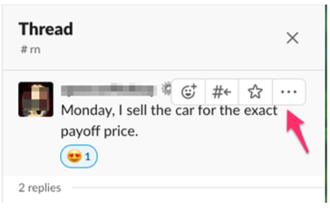

### Painel de Ação (Action Panel)

O painel de ação é um agrupamento de comandos que permanece visível na interface principal, geralmente localizado em uma barra lateral ou abaixo de um objeto central. Ao contrário dos menus tradicionais que precisam ser abertos para revelar suas opções, este padrão oferece acesso direto com um único clique às tarefas mais relevantes ou executadas com maior frequência. Ele funciona como uma vitrine permanente de capacidades do software, aumentando significativamente a descoberta das funções, especialmente para usuários iniciantes que podem não saber procurar comandos dentro de menus suspensos ou barras de menu complexas.

A estrutura de um painel de ação pode ser dinâmica, alterando seu conteúdo com base no estado da aplicação ou nos itens selecionados no momento. Isso permite que a interface se adapte às necessidades imediatas do usuário, apresentando apenas as ferramentas que fazem sentido para o contexto atual de trabalho. Em aplicações de produtividade, como gerenciadores de arquivos ou ferramentas de design, esses painéis frequentemente utilizam categorias, títulos e até descrições mais longas para explicar detalhadamente o que cada comando faz, proporcionando uma experiência de aprendizado contínua enquanto o trabalho principal é realizado.

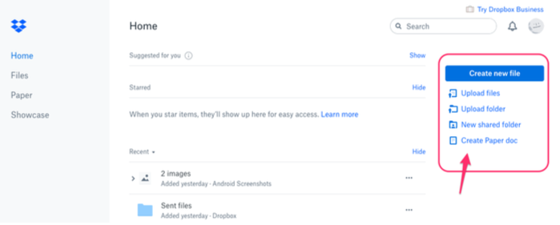

### Botão "Concluir" Proeminente (Prominent "Done" Button)

O botão de conclusão proeminente é um elemento visualmente forte que serve como o passo final preferido ou a conclusão óbvia de uma tarefa ou processo em uma tela. Ele é projetado para dar ao usuário uma sensação de fechamento e segurança, eliminando qualquer dúvida sobre como finalizar uma transação complexa, como uma compra online ou o salvamento de configurações críticas. O uso de cores contrastantes, tamanhos maiores e uma posição estratégica — geralmente ao final do fluxo visual natural de leitura — garante que este botão seja a primeira coisa que o usuário note após completar sua interação inicial.

A escolha do rótulo para este botão é fundamental para sua eficácia, sendo recomendável o uso de verbos de ação específicos como "Enviar", "Comprar" ou "Salvar" em vez de termos genéricos como "OK" ou "Concluído". Isso comunica com precisão o que acontecerá quando o botão for clicado, reforçando a intenção do usuário e reduzindo a ansiedade sobre as consequências da ação. Além disso, o design deve cercar o botão com um espaço em branco adequado para evitar distrações, garantindo que ele não se perca em meio a outros controles secundários e guiando o olhar do usuário diretamente para a saída lógica do processo.

### 5. Pré-visualização (Preview)

A pré-visualização é um padrão de design que renderiza uma amostra realista ou um modelo do provável resultado de uma ação antes que o usuário a confirme definitivamente. Essa abordagem inverte a lógica tradicional de "tentativa e erro", onde o usuário aplica um comando e depois precisa desfazê-lo se não gostar do resultado visual ou técnico. Ao oferecer um feedback visual antecipado, o sistema reduz drasticamente a ocorrência de erros dispendiosos e a frustração do usuário, especialmente em tarefas complexas como a aplicação de filtros em fotos, a impressão de documentos longos ou a personalização de produtos em sites de e-commerce.

Implementar uma pré-visualização eficaz exige que o sistema forneça informações claras e essenciais que permitam ao usuário tomar uma decisão informada sem sobrecarregá-lo com detalhes técnicos desnecessários. O usuário deve ter a capacidade de alternar entre diferentes opções ou ajustar parâmetros diretamente na tela de visualização, confirmando a ação final somente quando estiver satisfeito com o que vê. Esse padrão não apenas melhora a precisão do trabalho final, mas também torna a interface mais envolvente e interativa, encorajando o usuário a explorar diferentes possibilidades criativas com a confiança de que o sistema é previsível.

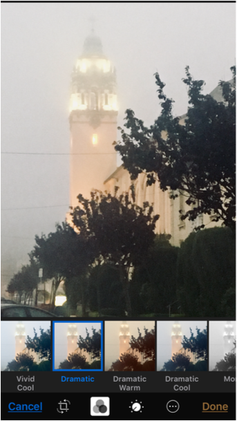

### Indicadores de Carregamento (Spinners and Loading Indicators)

Indicadores de carregamento, como spinners e barras de progresso, são elementos visuais essenciais que comunicam ao usuário que o sistema está processando uma solicitação em segundo plano. Os spinners são animações cíclicas, geralmente sem estado definido, ideais para esperas curtas de até dois segundos, servindo para manter o foco do usuário e assegurar que a interface não travou. Já as barras de carregamento fornecem informações detalhadas para processos mais longos, indicando a porcentagem concluída, a quantidade de dados processados e uma estimativa do tempo restante, o que ajuda a gerenciar a paciência e as expectativas do usuário.

A ausência desses indicadores em processos demorados pode levar o usuário a acreditar que o software falhou ou parou de responder, resultando no abandono da tarefa ou em cliques repetitivos que podem sobrecarregar o servidor. Por isso, é uma prática recomendada iniciar o feedback visual quase instantaneamente após qualquer comando que não tenha resposta imediata detectável. Além de informar sobre o progresso, esses componentes devem, sempre que possível, oferecer uma maneira clara de interromper a operação, mantendo o usuário no controle total da experiência de interação mesmo durante períodos de processamento intensivo.

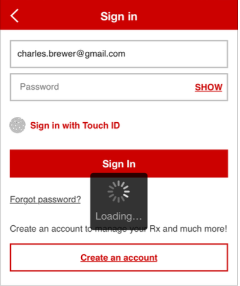

### Cancelabilidade (Cancelability)

A cancelabilidade é a capacidade de um sistema de interromper instantaneamente uma operação em processo sem deixar efeitos colaterais, corrupção de dados ou resíduos indesejados no sistema. Este padrão é vital para garantir que o usuário mantenha o controle e a liberdade sobre o software, especialmente durante processos que consomem muito tempo ou que foram iniciados por engano. A presença de um botão de cancelamento claro, geralmente identificado por um ícone de "X" ou pelo rótulo "Parar", encoraja a exploração segura da interface, pois o usuário sabe que pode desistir de qualquer ação se mudar de ideia ou se perceber um erro.

Para ser verdadeiramente eficaz, a função de cancelar deve responder imediatamente ao comando do usuário, interrompendo o processamento e atualizando a interface para refletir que a ação foi cessada com sucesso. Em sistemas com múltiplas operações paralelas, é importante fornecer controles individuais para cada processo, evitando ambiguidades sobre qual tarefa está sendo interrompida no momento. Ao garantir que as ações sejam reversíveis ou canceláveis antes de sua conclusão, o designer reduz a ansiedade do usuário e promove um ambiente de trabalho mais dinâmico e menos punitivo, onde o erro é visto como uma parte natural da aprendizagem.

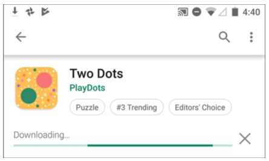

### Desfazer Multinível (Multilevel Undo)

O desfazer multinível é um padrão avançado que permite ao usuário reverter uma sequência de ações recentes passo a passo, na ordem exatamente inversa em que foram realizadas originalmente. Essa funcionalidade é o alicerce da "exploração segura", pois dá aos usuários, tanto iniciantes quanto especialistas, a confiança necessária para experimentar ferramentas complexas sem o medo constante de causar danos irreparáveis aos seus arquivos ou dados. Ao manter um histórico de estados anteriores, o sistema permite que o usuário volte no tempo para corrigir deslizes acidentais ou para comparar diferentes direções criativas durante o desenvolvimento de um projeto.

Para que este padrão seja útil e intuitivo, é essencial que o sistema registre apenas as ações que alteram significativamente o conteúdo ou os dados, ignorando mudanças puramente visuais e efêmeras, como rolagens de página ou seleções de abas. O acesso a essa função deve ser fácil e rápido, geralmente através de atalhos de teclado universais ou menus inteligentes que descrevem exatamente qual ação será desfeita a seguir. Um histórico de desfazer bem implementado não apenas salva o trabalho do usuário em momentos de erro crítico, mas também atua como uma ferramenta de produtividade que permite testar hipóteses com agilidade e precisão.

### Histórico de Comandos (Command History)

O histórico de comandos é um registro visível e persistente das etapas e ações que o usuário realizou ao longo de sua sessão de trabalho ou navegação. Ao contrário do simples comando de desfazer, este padrão oferece uma lista cronológica detalhada que pode ser consultada para revisão, repetição de tarefas ou até mesmo para saltar diretamente para um estado específico e anterior do projeto. Esse recurso é extremamente valioso em softwares profissionais de edição de imagem, programação e navegadores web, onde a capacidade de rastrear o caminho percorrido facilita a compreensão de fluxos de trabalho complexos e a recuperação de informações.

Além de servir como um log passivo de atividades, o histórico de comandos pode ser uma ferramenta ativa de manipulação, permitindo que o usuário reordene ações ou aplique sequências passadas a novos objetos de forma automática. Em navegadores, ele auxilia na redescoberta de conteúdos visitados anteriormente, enquanto em editores gráficos, permite desativar filtros específicos no meio de uma cadeia complexa de edições. Ao tornar os passos do usuário visíveis e gerenciáveis, este padrão transforma a interação linear em uma experiência multidimensional, onde o passado do usuário se torna um recurso valioso e acessível para otimizar suas ações futuras.

# Referências

Jenifer Tidwell et al. Designing Interfaces: Patterns for Effective Interaction Design. Terceira Edição. O'Reilly.
[Link](https://www.oreilly.com/library/view/designing-interfaces-3rd/9781492051954/).

Michael Filipiuk. UI Design Principles [eBook]. Acesso em 18 de janeiro de 2026. [Link](https://michaelfilipiuk.gumroad.com/l/uiguide).